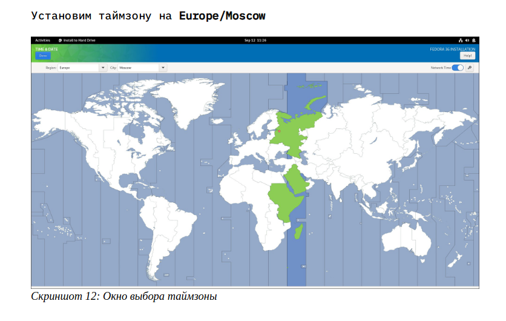
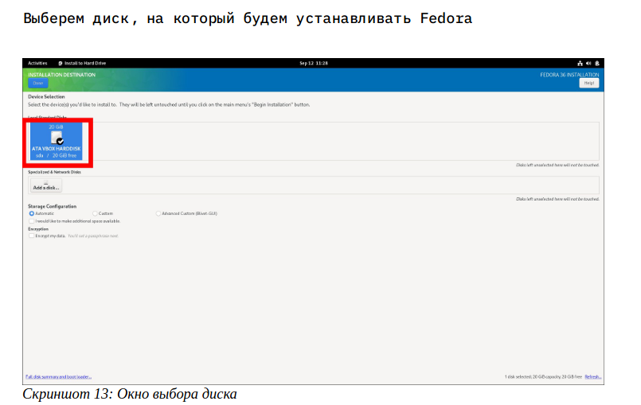
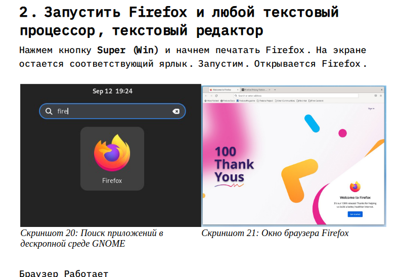

---
## Front matter
lang: ru-RU
title:  Установка Linux на виртуальную машину
subtitle: Дисциплина Операционные стстемы
author:
  - Осокин Георгий Иванович НММбд-02-22
institute:
  - Российский университет дружбы народов, Москва, Россия
date: 15 января 2023

## i18n babel
babel-lang: russian
babel-otherlangs: english

## Formatting pdf
toc: false
toc-title: Содержание
slide_level: 2
aspectratio: 169
section-titles: true
theme: metropolis
header-includes:
 - \metroset{progressbar=frametitle,sectionpage=progressbar,numbering=fraction}
 - '\makeatletter'
 - '\beamer@ignorenonframefalse'
 - '\makeatother'
---

# Информация

## Докладчик

:::::::::::::: {.columns align=center}
::: {.column width="70%"}

  * Осокин Георгий Иванович
  * Студент группы НММбд-02-22
  * Российский университет дружбы народов
  * [1132226517@pfur.ru](1132226517@pfur.ru)
  * <https://github.com/horhik/>

:::
:::

## Цель работы

## Приобрести практические навыки установки операционных систем на виртуальные машины.
## Ознакомиться с операционной системой GNU/Linux
## Установить дистрибутив Fedora ОС GNU/Linux
## Ознакомиться с командной строкой OC Linux

# Выполнение лабораторной работы

## Настройка виртуальной машины

## Настройка Virtual Box 

## Создание виртуальной машины

## Установка объема памяти 

## Виртуальный жесткий диск

## Увелечение объема видеопамяти

## Установка образа

## Установка дистрибтива Fedora

##  Выбор языка

## Выбор часового пояса

## Выбор диска

## Подготока к установка

##  Установка

## Удалние образа

# Задания для самостоятельно работы 

## Запустить виртуальную машину

## Создание пользователя

##  Запуск браузера

## Запуск текстовго процессора

## Запуск терминала 

## Установка основго ПО

## Midnight COmmander

# Заключение

## Выводы

Как оказалось установить дистрибутив Fedora довольно не сложно. Но
это и есть одна из заслуг данного дистрибутива. Благодаря
автоматическому установщику, нам пришлось поделать необходимый
минимум операций, которые может проделать любой пользователь.
Если бы мы решили установить Gentoo, Archlinux, NixOS или какую-
нибудь другую систему из всего множества дистрибутивов GNU/Linux,
то нам пришлось бы более точечно работать над процессом установки,
который был бы уже не под силу рядовому пользователю ПК.
И это один из плюсов систем GNU/Linux — наличие альтернатив. При
выборе дистрибутива у нас есть возможность установить систему со
всеми предустановленными программами и потратить минимум времени

