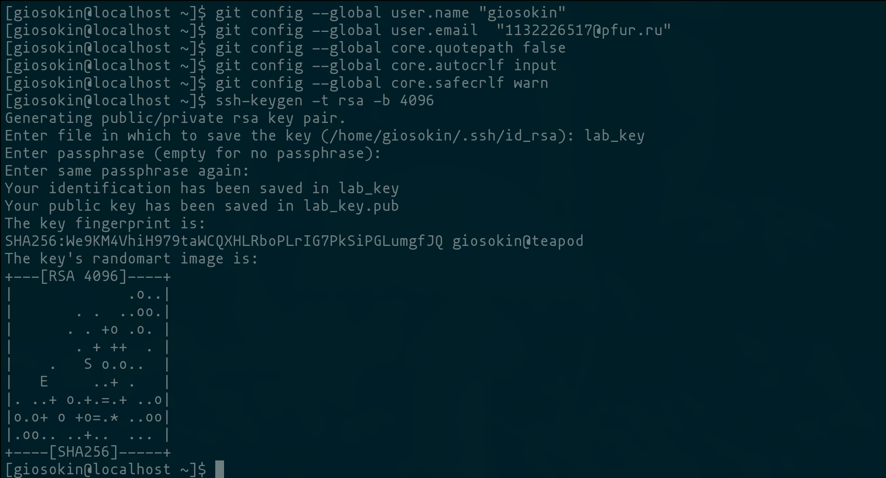
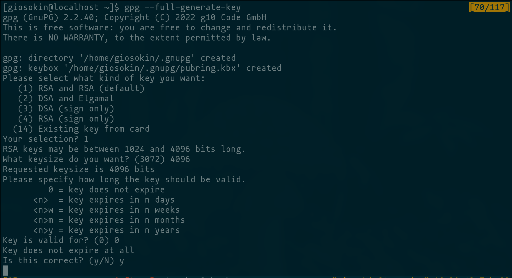
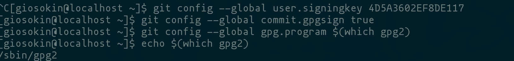
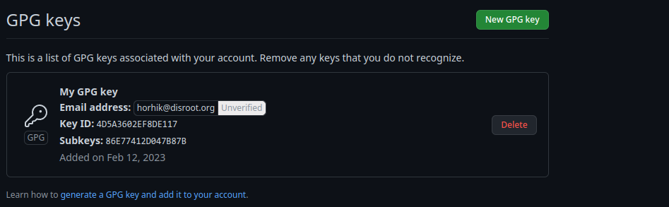
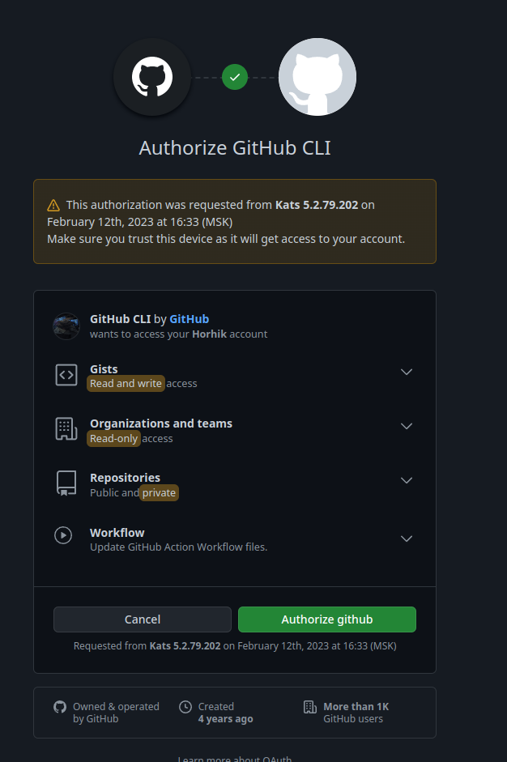
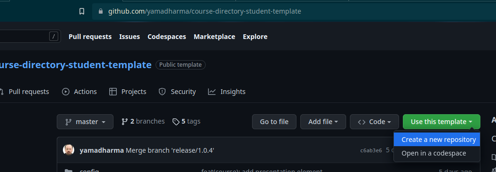
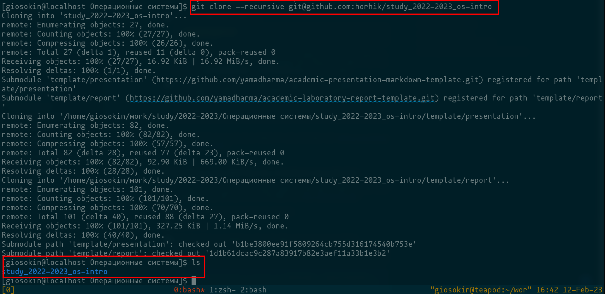
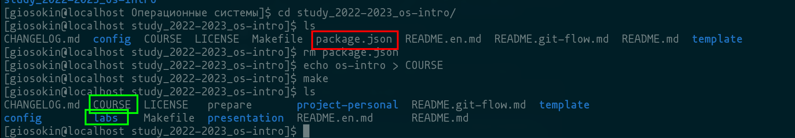
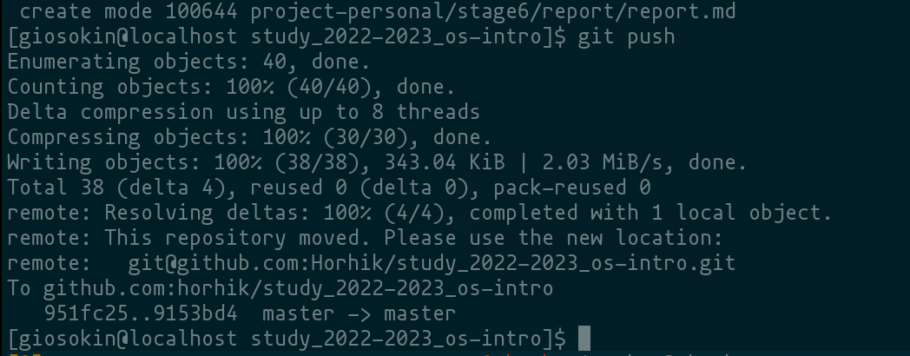

---
## Front matter
lang: ru-RU
title:  Первоначальна настройка git.
subtitle: Дисциплина Операционные стстемы
author:
  - Осокин Георгий Иванович НММбд-02-22
institute:
  - Российский университет дружбы народов, Москва, Россия
date: 15 января 2023

## i18n babel
babel-lang: russian
babel-otherlangs: english

## Formatting pdf
toc: false
toc-title: Содержание
slide_level: 2
aspectratio: 169
section-titles: true
theme: metropolis
header-includes:
 - \metroset{progressbar=frametitle,sectionpage=progressbar,numbering=fraction}
 - '\makeatletter'
 - '\beamer@ignorenonframefalse'
 - '\makeatother'
---

# Информация

## Докладчик

:::::::::::::: {.columns align=center}
::: {.column width="70%"}

  * Осокин Георгий Иванович
  * Студент группы НММбд-02-22
  * Российский университет дружбы народов
  * [1132226517@pfur.ru](1132226517@pfur.ru)
  * <https://github.com/horhik/>

:::
:::

# Цель работы

## Изучить идеологию и применение средств контроля версий
## Освоить умения по работе с git

# Выполнение лабораторной работы

# Настройка GIT

## Конфигурация GIT  

  Сконфигурируем `git` и создадим `SSH` ключ
 
 {#fig:001 width=70%} 


## Создание PGP ключа  

  Создадим PGP ключ
 
 {#fig:002 width=70%} 


## Подпись коммитов PGP ключем 

Настроим подпись коммитов нашим PGP ключом

 {#fig:003 width=70%} 

## Добавление ключа на гитхаб 

С помощью комманды `gpg --armor --export <PGP Fingerprint> | xclip -sel clip`  скопируем PGP ключ
И вставим в гитхаб

 
 {#fig:004 width=70%} 


## Авторизация на гитхабе 

Авторизируемся на гитхабе с помощью комманды `gh`
 
 {#fig:005 width=70%} 


## Создание рабочего пространства

Перейдем в репозиторий с шаблоном и создадим из него шаблон

 
 {#fig:006 width=70%} 
	

## Клонирование репозитория  

После создания шаблона, склонируем репозиторий на локальную машину
 
 {#fig:007 width=70%} 

## Удаление фалйа package.json и создание файла COURSE  

Перейдем в репозиторий и удалим `package.json`
Также создадим файл COURSE с текстом "os-intro"

 
 {#fig:008 width=70%} 

также запустим комманду `make`, которая сгенирирует файловую структуру. 
Убедимся коммандой `ls`

## Git push 

Теперь запушим на гитхаб изменения. До этого исполнив `git add` и `git commit` с названием коммита `feat(main): make course structure`

 
 {#fig:009 width=70%} 


## Просмотр нового коммита на гихабе 

Зайдем на гитхаб и убедимся что изменения запустились
 
 {#fig:010 width=70%} 

# Заключение

## Выводы


Мы изучили идеологию применения средств контроля версий и осовили базовые комманды утилиты git. 


# Вводная часть

## Актуальность

- Важно донести результаты своих исследований до окружающих
- Научная презентация --- рабочий инструмент исследователя
- Необходимо создавать презентацию быстро
- Желательна минимизация усилий для создания презентации

## Объект и предмет исследования

- Презентация как текст
- Программное обеспечение для создания презентаций
- Входные и выходные форматы презентаций

## Цели и задачи

- Создать шаблон презентации в Markdown
- Описать алгоритм создания выходных форматов презентаций

## Материалы и методы

- Процессор `pandoc` для входного формата Markdown
- Результирующие форматы
	- `pdf`
	- `html`
- Автоматизация процесса создания: `Makefile`

# Создание презентации

## Процессор `pandoc`

- Pandoc: преобразователь текстовых файлов
- Сайт: <https://pandoc.org/>
- Репозиторий: <https://github.com/jgm/pandoc>

## Формат `pdf`

- Использование LaTeX
- Пакет для презентации: [beamer](https://ctan.org/pkg/beamer)
- Тема оформления: `metropolis`

## Код для формата `pdf`

```yaml
slide_level: 2
aspectratio: 169
section-titles: true
theme: metropolis
```

## Формат `html`

- Используется фреймворк [reveal.js](https://revealjs.com/)
- Используется [тема](https://revealjs.com/themes/) `beige`

## Код для формата `html`

- Тема задаётся в файле `Makefile`

```make
REVEALJS_THEME = beige 
```
# Результаты

## Получающиеся форматы

- Полученный `pdf`-файл можно демонстрировать в любой программе просмотра `pdf`
- Полученный `html`-файл содержит в себе все ресурсы: изображения, css, скрипты

# Элементы презентации

## Актуальность

- Даёт понять, о чём пойдёт речь
- Следует широко и кратко описать проблему
- Мотивировать свое исследование
- Сформулировать цели и задачи
- Возможна формулировка ожидаемых результатов

## Цели и задачи

- Не формулируйте более 1--2 целей исследования

## Материалы и методы

- Представляйте данные качественно
- Количественно, только если крайне необходимо
- Излишние детали не нужны

## Содержание исследования

- Предлагаемое решение задач исследования с обоснованием
- Основные этапы работы

## Результаты

- Не нужны все результаты
- Необходимы логические связки между слайдами
- Необходимо показать понимание материала


## Итоговый слайд

- Запоминается последняя фраза. © Штирлиц
- Главное сообщение, которое вы хотите донести до слушателей
- Избегайте использовать последний слайд вида *Спасибо за внимание*

# Рекомендации

## Принцип 10/20/30

  - 10 слайдов
  - 20 минут на доклад
  - 30 кегль шрифта

## Связь слайдов

::: incremental

- Один слайд --- одна мысль
- Нельзя ссылаться на объекты, находящиеся на предыдущих слайдах (например, на формулы)
- Каждый слайд должен иметь заголовок

:::

## Количество сущностей

::: incremental

- Человек может одновременно помнить $7 \pm 2$ элемента
- При размещении информации на слайде старайтесь чтобы в сумме слайд содержал не более 5 элементов
- Можно группировать элементы так, чтобы визуально было не более 5 групп

:::

## Общие рекомендации

::: incremental

- На слайд выносится та информация, которая без зрительной опоры воспринимается хуже
- Слайды должны дополнять или обобщать содержание выступления или его частей, а не дублировать его
- Информация на слайдах должна быть изложена кратко, чётко и хорошо структурирована
- Слайд не должен быть перегружен графическими изображениями и текстом
- Не злоупотребляйте анимацией и переходами

:::

## Представление данных

::: incremental

- Лучше представить в виде схемы
- Менее оптимально представить в виде рисунка, графика, таблицы
- Текст используется, если все предыдущие способы отображения информации не подошли

:::

