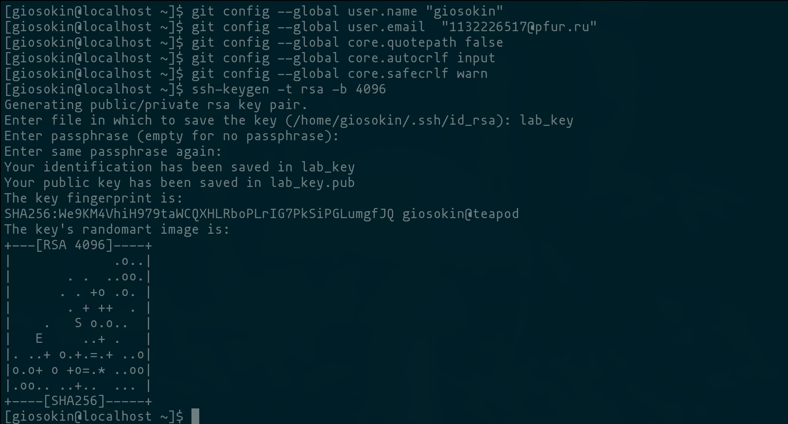
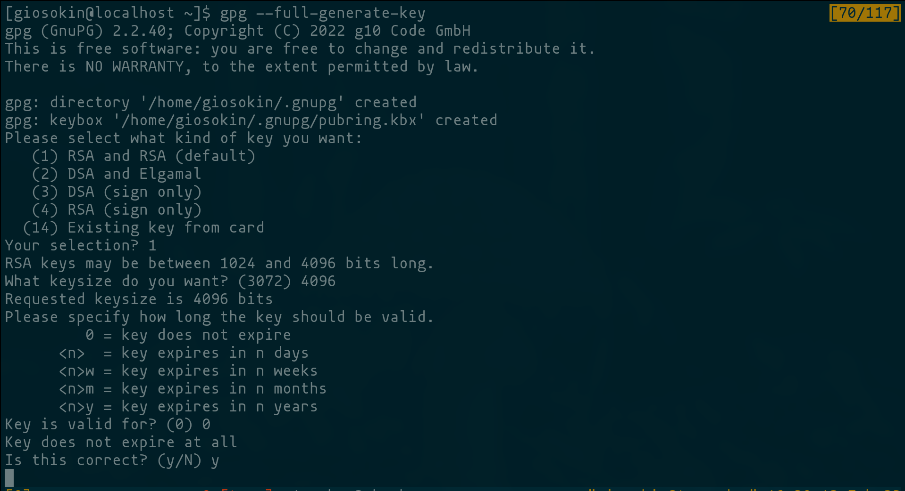
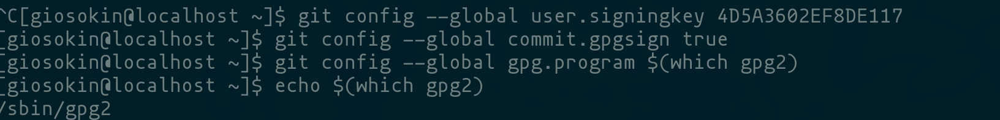
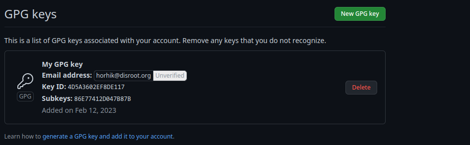
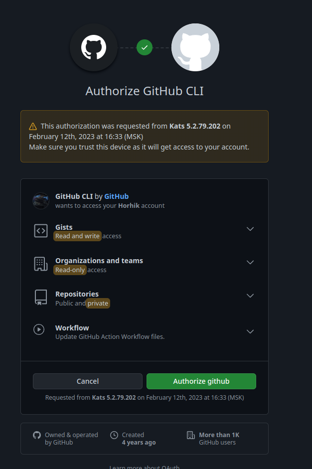
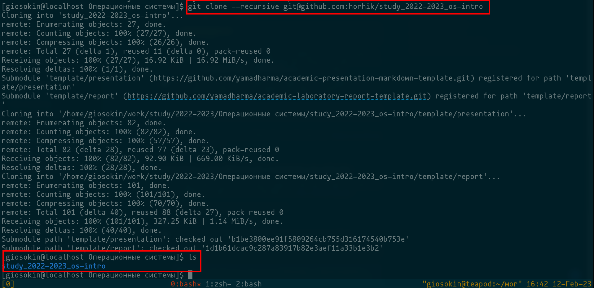
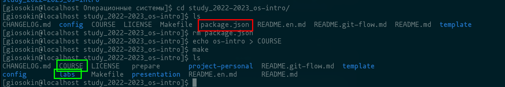
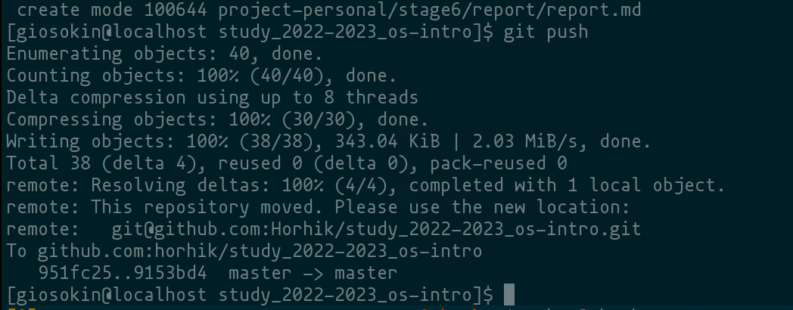
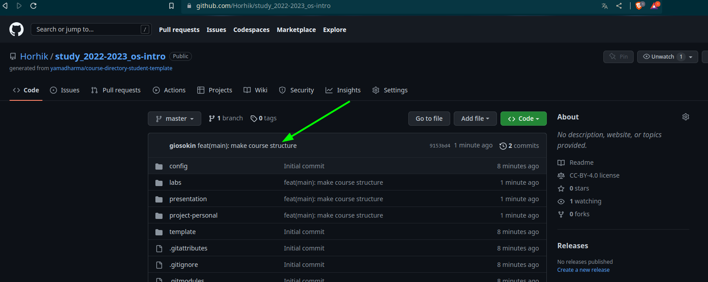

---
## Front matter
title: "Лабораторная работа №2  Первоначальна настройка git"
subtitle: "Дисциплина Операционные системы"
author: "Осокин Георгий Иванович НММбд-02-22"

## Generic otions
lang: ru-RU
toc-title: "Содержание"

## Bibliography
bibliography: bib/cite.bib
csl: pandoc/csl/gost-r-7-0-5-2008-numeric.csl

## Pdf output format
toc: true # Table of contents
toc-depth: 2
lof: true # List of figures
lot: true # List of tables
fontsize: 12pt
linestretch: 1.5
papersize: a4
documentclass: scrreprt
## I18n polyglossia
polyglossia-lang:
  name: russian
  options:
	- spelling=modern
	- babelshorthands=true
polyglossia-otherlangs:
  name: english
## I18n babel
babel-lang: russian
babel-otherlangs: english
## Fonts
mainfont: PT Serif
romanfont: PT Serif
sansfont: PT Sans
monofont: PT Mono
mainfontoptions: Ligatures=TeX
romanfontoptions: Ligatures=TeX
sansfontoptions: Ligatures=TeX,Scale=MatchLowercase
monofontoptions: Scale=MatchLowercase,Scale=0.9
## Biblatex
biblatex: true
biblio-style: "gost-numeric"
biblatexoptions:
  - parentracker=true
  - backend=biber
  - hyperref=auto
  - language=auto
  - autolang=other*
  - citestyle=gost-numeric
## Pandoc-crossref LaTeX customization
figureTitle: "Рис."
tableTitle: "Таблица"
listingTitle: "Листинг"
lofTitle: "Список иллюстраций"
lotTitle: "Список таблиц"
lolTitle: "Листинги"
## Misc options
indent: true
header-includes:
  - \usepackage{indentfirst}
  - \usepackage{float} # keep figures where there are in the text
  - \floatplacement{figure}{H} # keep figures where there are in the text
---

# Цель работы
- Изучить идеологию и применение средств контроля версий
- Освоить умения по работе с git

# Выполнение лабораторной работы

## Настройка GIT

  Сконфигурируем `git` и создадим `SSH` ключ

{#fig:001 width=70%}

  Создадим PGP ключ

{#fig:002 width=70%}

Настроим подпись коммитов нашим PGP ключом

{#fig:003 width=70%}

Добавим PGP ключ на гитхаб.

С помощью комманды `gpg --armor --export <PGP Fingerprint> | xclip -sel clip`  скопируем PGP ключ
И вставим в гитхаб

{#fig:004 width=70%}

Авторизируемся на гитхабе с помощью комманды `gh`

{#fig:005 width=70%}

## Создание рабочего пространства

Перейдем в репозиторий с шаблоном и создадим из него шаблон

{#fig:006 width=70%}
	
После создания шаблона, склонируем репозиторий на локальную машину

{#fig:007 width=70%}

Перейдем в репозиторий и удалим `package.json`
Также создадим файл COURSE с текстом "os-intro"

{#fig:008 width=70%}

также запустим комманду `make`, которая сгенирирует файловую структуру. 
Убедимся коммандой `ls`

Теперь запушим на гитхаб изменения. До этого исполнив `git add` и `git commit` с названием коммита `feat(main): make course structure`

{#fig:009 width=70%}

Зайдем на гитхаб и убедимся что изменения запустились

{#fig:010 width=70%}

# Ответы на контрольные вопросы

#### Что такое системы контроля версий (VCS) и для решения каких задач они предназначаются?

Системы контроля версий применяются для фиксации изменений в программе и коллективной разработки

#### Объясните следующие понятия VCS и их отношения: хранилище, commit, история, рабочая копия.

Хранилище: хранилище всех изменений и версий
Commit: Единица изменения
История: Последовательность коммитов
Рабочая копия: Последняя версия

#### Что представляют собой и чем отличаются централизованные и децентрализованные VCS? Приведите примеры VCS каждого вида.

Децентрализованные VCS скачивают на хост всю цепочку изменений, а централизованные позволяют только подключаться к полноценному хранилищу и запрашивать конкретную версию.

#### Опишите действия с VCS при единоличной работе с  хранилищем.

Пользователь может склонировать версию на свою машину, внести изменения и создать ветку

#### Опишите порядок работы с общим хранилищем VCS.

Пользователь запрашивает у хранилища определенную версию программы, VCS выдает ему эту версию, он вносит туда изменения и оправляет их обратно. VCS сохраняет изменения новой версии 

#### Каковы основные задачи, решаемые инструментальным средством git?

1. Разработка больших проектов коммандами

2. Контроль изменений множества файлов и откат изменений

3. Возможность сохранять несколько состояний разработки программы 

#### Назовите и дайте краткую характеристику командам git.

`git add` - добавить изменения в коммит

`git commit` - сохранить изменения присвоив им название

`git push` - отправить изменения на удаленный репозиторий

`git config` - изменение параметров git

#### Приведите примеры использования при работе с локальным и удалённым репозиториями.

В большом проекте разработчики будут клонировать локальный репозиторий себе на устройства, благодоря чему смогут работать параллельно.

Если же репозиторий слишком большой, разработчики могут подключаться к нему удаленно и править код в новых ветках и т.п.

#### Что такое и зачем могут быть нужны ветви (branches)?

Ветви могут быть нужни для совместной работы над проектом, для разработки нескольких функций программы одновременно, что бы не конфликтовать файлами при параллельной разработки программы несколькими людьми

#### Как и зачем можно игнорировать некоторые файлы при commit?

Файлы стоит вносить в .gitignore, это сделанно для того, что бы не загружать репозиторий лишними файлами или избегать утечки личной информации (баз данных и так далее)

# Выводы

Мы изучили идеологию применения средств контроля версий и осовили базовые комманды утилиты git. 

