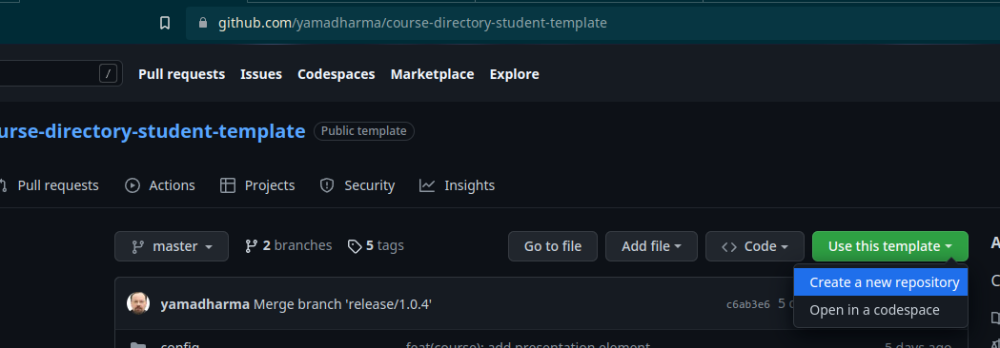

---
## Front matter
title: "Лабораторная работа №2  Первоначальна настройка git"
subtitle: "Дисциплина Операционные системы"
author: "Осокин Георгий Иванович НММбд-02-22"

## Generic otions
lang: ru-RU
toc-title: "Содержание"

## Bibliography
bibliography: bib/cite.bib
csl: pandoc/csl/gost-r-7-0-5-2008-numeric.csl

## Pdf output format
toc: true # Table of contents
toc-depth: 2
lof: true # List of figures
lot: true # List of tables
fontsize: 12pt
linestretch: 1.5
papersize: a4
documentclass: scrreprt
## I18n polyglossia
polyglossia-lang:
  name: russian
  options:
	- spelling=modern
	- babelshorthands=true
polyglossia-otherlangs:
  name: english
## I18n babel
babel-lang: russian
babel-otherlangs: english
## Fonts
mainfont: PT Serif
romanfont: PT Serif
sansfont: PT Sans
monofont: PT Mono
mainfontoptions: Ligatures=TeX
romanfontoptions: Ligatures=TeX
sansfontoptions: Ligatures=TeX,Scale=MatchLowercase
monofontoptions: Scale=MatchLowercase,Scale=0.9
## Biblatex
biblatex: true
biblio-style: "gost-numeric"
biblatexoptions:
  - parentracker=true
  - backend=biber
  - hyperref=auto
  - language=auto
  - autolang=other*
  - citestyle=gost-numeric
## Pandoc-crossref LaTeX customization
figureTitle: "Рис."
tableTitle: "Таблица"
listingTitle: "Листинг"
lofTitle: "Список иллюстраций"
lotTitle: "Список таблиц"
lolTitle: "Листинги"
## Misc options
indent: true
header-includes:
  - \usepackage{indentfirst}
  - \usepackage{float} # keep figures where there are in the text
  - \floatplacement{figure}{H} # keep figures where there are in the text
---

# Цель работы

- Изучить идеологию и применение средств контроля версий
- Освоить умения по работе с git

# Выполнение лабораторной работы
## Настройка GIT

  Сконфигурируем `git` и создадим `SSH` ключ

{#fig:001 width=70%}

  Создадим PGP ключ

{#fig:002 width=70%}

Настроим подпись коммитов нашим PGP ключом

{#fig:003 width=70%}

Добавим PGP ключ на гитхаб.

С помощью комманды `gpg --armor --export <PGP Fingerprint> | xclip -sel clip`  скопируем PGP ключ
И вставим в гитхаб

{#fig:004 width=70%}

Авторизируемся на гитхабе с помощью комманды `gh`

{#fig:005 width=70%}

## Создание рабочего пространства

Перейдем в репозиторий с шаблоном и создадим из него шаблон

{#fig:006 width=70%}
	
После создания шаблона, склонируем репозиторий на локальную машину

{#fig:007 width=70%}

Перейдем в репозиторий и удалим `package.json`
Также создадим файл COURSE с текстом "os-intro"

{#fig:008 width=70%}

также запустим комманду `make`, которая сгенирирует файловую структуру. 
Убедимся коммандой `ls`

Теперь запушим на гитхаб изменения. До этого исполнив `git add` и `git commit` с названием коммита `feat(main): make course structure`

{#fig:009 width=70%}

Зайдем на гитхаб и убедимся что изменения запустились

{#fig:010 width=70%}

# Выводы

Мы изучили идеологию применения средств контроля версий и осовили базовые комманды утилиты git. 

