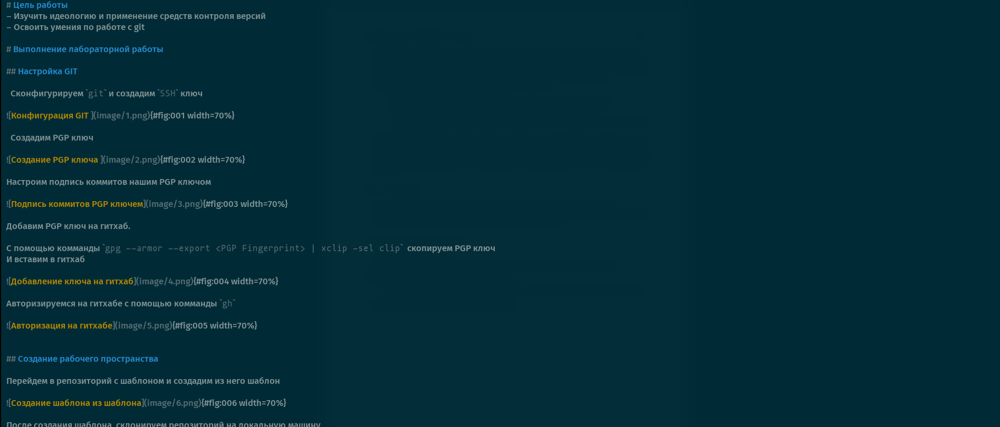
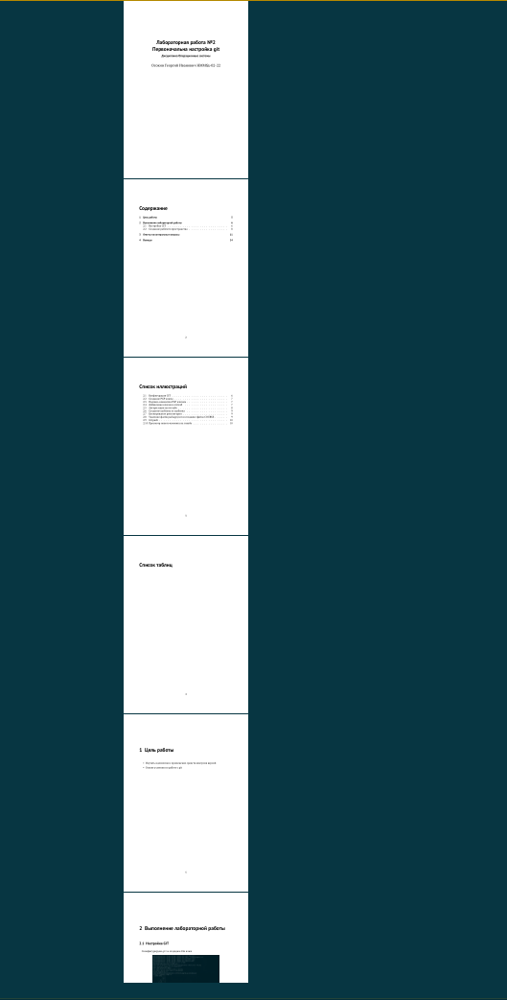
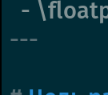

---
## Front matter
lang: ru-RU
title: Markdown
subtitle: Лабораторная 3
author:
  - Осокин Г. И 
institute:
  - Российский университет дружбы народов, Москва, Россия
date: 22 февраля 2023

## i18n babel
babel-lang: russian 
babel-otherlangs: english

## Formatting pdf
toc: false
toc-title: Содержание
slide_level: 2
aspectratio: 169
section-titles: true
theme: metropolis
header-includes:
 - \metroset{progressbar=frametitle,sectionpage=progressbar,numbering=fraction}
 - '\makeatletter'
 - '\beamer@ignorenonframefalse'
 - '\makeatother'
---

# Информация

## Докладчик

:::::::::::::: {.columns align=center}
::: {.column width="70%"}

  * Осокин Георгий Ивановчи
  * Студент НММбд-02-22
  * Российский университет дружбы народов
  * [1132226517@pfur.ru](1132226517@pfur.ru)

:::

::::::::::::::

# Вводная часть

## Актуальность

Язык  Markdown очень удобен для быстрого написания стилизованного текста

# Цели и задачи

##  Цель работы

Освоить язык маркаун, сделать лабора торную 2

# Выполнение лабораторной работы

## Сделаем отчет лаборатоной 2 в  Markdown

{#fig:001 width=70%}

## Сгенерируем PDF из файла

{#fig:002 width=70%}

## Мета информация

Для генерации PDF нам помогает  мета информация в начале Markdown файла, которая обособляется `---`

{#fig:003 width=70%}

# Заключение

## Выводы

Мы сделали лабораторную работу 2  используя язык разметки маркдону

