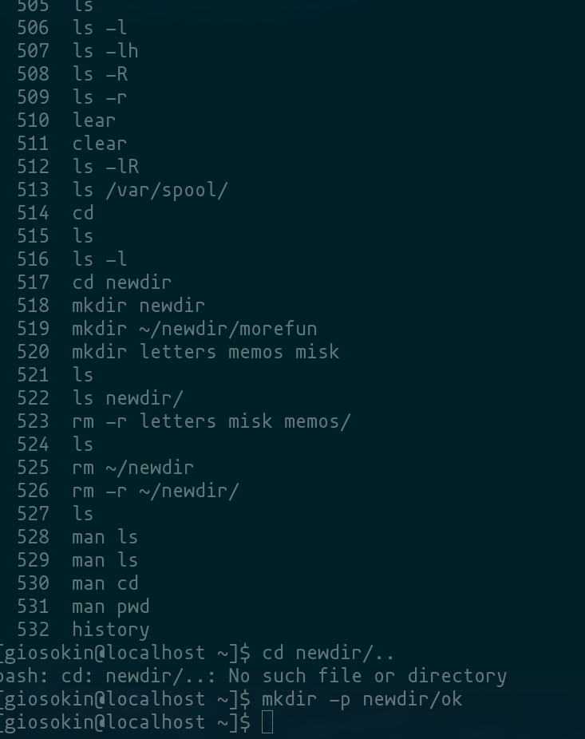

---
## Front matter
lang: ru-RU
title: Лабораторная 4
subtitle: Markdown
author:
  - Осокин Г.И
institute:
  - Российский университет дружбы народов, Москва, Россия
date: 03  марта 2059

## i18n babel
babel-lang: russian
babel-otherlangs: english

## Formatting pdf
toc: false
toc-title: Содержание
slide_level: 2
aspectratio: 169
section-titles: true
theme: metropolis
header-includes:
 - \metroset{progressbar=frametitle,sectionpage=progressbar,numbering=fraction}
 - '\makeatletter'
 - '\beamer@ignorenonframefalse'
 - '\makeatother'
---

# Информация

## Докладчик

:::::::::::::: {.columns align=center}
::: {.column width="70%"}

  * Осокин Георгий Ивановчи
  * Студент НММбд-02-22
  * Российский университет дружбы народов
  * [1132226517@pfur.ru](1132226517@pfur.ru)

:::

::::::::::::::

# Задачи

## Цель работы

Приобретение практических навыков взаимодействия пользвателя с системой посредством коммандной строки.

# Выполнение лабораторной работы

## Определим полное имя домашнего каталога

{#fig:001 width=70%}

# Работа с cd и ls

## ls 

выведем содержимое

{#fig:2 width=70%}

## ls

выведем содержимое по другому

{#fig:3 width=70%}

## ls

выведем рекурсивно

{#fig:4 width=70%}


## ls 

просмотрим `/var/spool`

## ls


введем ls и просомтрим файлы в домашней директории. 
Просмотрим разрешения с помощью ls -l

{#fig:5 width=70%}

## ls 

{#fig:6 width=70%}

# Работа с mkdir

## mkdir
- создадим директорию `newdir`
- создадим в ней  поддиректорию `morefun` 
- создадим три папки
- просмотрим все с помощью ls и 

## mkdir 

{#fig:7 width=70%}

## rm -r

удалим созданные три папки

{#fig:8 width=70%}

## rm 

попытаемся удалить newdir с помощью rm 

потом с помощью rm -r, т.к. у нас не получилось

{#fig:9 width=70%}

# Работа с man

## man

откроем мануал по `ls`

{#fig:10 width=70%}

## man ls -R

откроем мануал man и найдем опцию про рекурсивному просмотру 

{#fig:11 width=70%}

## man ls -lt

найдем опцию `-lt` которая сортирует по времени

{#fig:12 width=70%}

## man cd

откроем мануал `cd`

{#fig:13 width=70%}

## man pwd

просмотрим man `pwd`

{#fig:14 width=70%}


# history

## просмотрим history

{#fig:15 width=70%}

# Ответы на контрольные вопросы

## 1.

Что такое командная строка?

интерфейс для взаимодействия пользователя с операционной системой

## 2.

При помощи какой команды можно определить абсолютный путь текущего каталога? Приведите пример.

pwd


## 3.

При помощи какой команды и каких опций можно определить только тип файлов и их имена в текущем каталоге? Приведите примеры.

ls

## 4.
Каким образом отобразить информацию о скрытых файлах? Приведите примеры.

ls -a

## 5.

При помощи каких команд можно удалить файл и каталог? Можно ли это сделать одной и той же командой? Приведите примеры.

rm -r

## 6.

Каким образом можно вывести информацию о последних выполненных пользовате- лем командах? работы?

history

## 7.

Как воспользоваться историей команд для их модифицированного выполнения? При- ведите примеры.

нажать tab

## 8.

Приведите примеры запуска нескольких команд в одной строке.

```
firefox &; telegram-dekstop
```

## 9.

Дайте определение и приведите примера символов экранирования.

```
\n
echo "meow\n"
```

## 10.

Охарактеризуйте вывод информации на экран после выполнения команды ls с опцией -l.

вывод подробной информации, включая права пользователей размер файла и авторство и число ссылок

## 11.

Что такое относительный путь к файлу? Приведите примеры использования относительного и абсолютного пути при выполнении какой-либо команды.

```
cd /home/username
cd ~
cd ../username
```


## 12.

Как получить информацию об интересующей вас команде?

`man <command>`
  
## 13. 

Какая клавиша или комбинация клавиш служит для автоматического дополнения вводимых команд?

```
tab
```

# Заключение

## Выводы

  * Мы НИЧЕМУ НЕ НАУЧИЛИСЬ ВСЕ ТЛЕН приобрели практические навыки взаимодействия пользователя с системой посредством коммандной строки

