---
## Front matter
title: "Лабораторная 4 Markdown"
subtitle: "markdown"
author: "Осокин Георгий иванович нммбд02-22"

## Generic otions
lang: ru-RU
toc-title: "Содержание"

## Bibliography
bibliography: bib/cite.bib
csl: pandoc/csl/gost-r-7-0-5-2008-numeric.csl

## Pdf output format
toc: true # Table of contents
toc-depth: 2
lof: true # List of figures
lot: true # List of tables
fontsize: 12pt
linestretch: 1.5
papersize: a4
documentclass: scrreprt
## I18n polyglossia
polyglossia-lang:
  name: russian
  options:
	- spelling=modern
	- babelshorthands=true
polyglossia-otherlangs:
  name: english
## I18n babel
babel-lang: russian
babel-otherlangs: english
## Fonts
mainfont: PT Serif
romanfont: PT Serif
sansfont: PT Sans
monofont: PT Mono
mainfontoptions: Ligatures=TeX
romanfontoptions: Ligatures=TeX
sansfontoptions: Ligatures=TeX,Scale=MatchLowercase
monofontoptions: Scale=MatchLowercase,Scale=0.9
## Biblatex
biblatex: true
biblio-style: "gost-numeric"
biblatexoptions:
  - parentracker=true
  - backend=biber
  - hyperref=auto
  - language=auto
  - autolang=other*
  - citestyle=gost-numeric
## Pandoc-crossref LaTeX customization
figureTitle: "Рис."
tableTitle: "Таблица"
listingTitle: "Листинг"
lofTitle: "Список иллюстраций"
lotTitle: "Список таблиц"
lolTitle: "Листинги"
## Misc options
indent: true
header-includes:
  - \usepackage{indentfirst}
  - \usepackage{float} # keep figures where there are in the text
  - \floatplacement{figure}{H} # keep figures where there are in the text
---

# Задачи

## Цель работы

Приобретение практических навыков взаимодействия пользвателя с системой посредством коммандной строки.

# Выполнение лабораторной работы

## Определим полное имя домашнего каталога

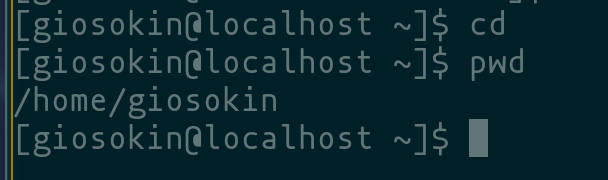{#fig:001 width=70%}

# Работа с cd и ls

## ls 

выведем содержимое

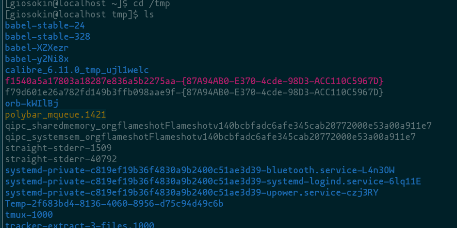{#fig:2 width=70%}

## ls

выведем содержимое по другому

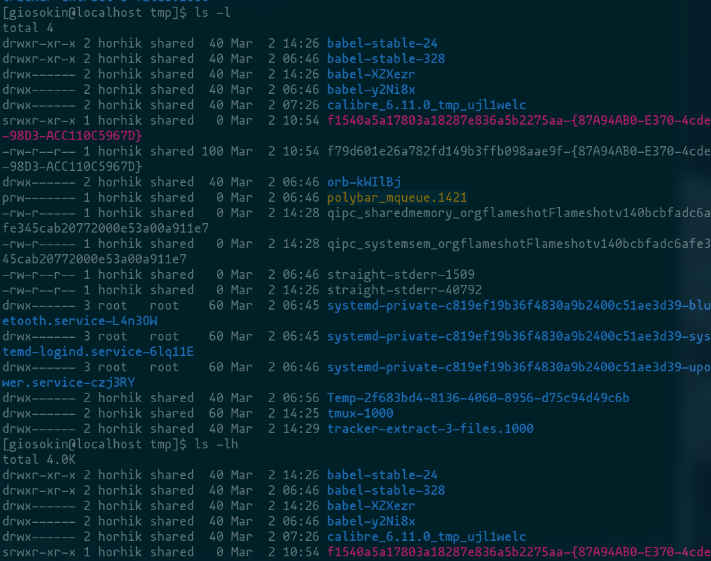{#fig:3 width=70%}

## ls

выведем рекурсивно

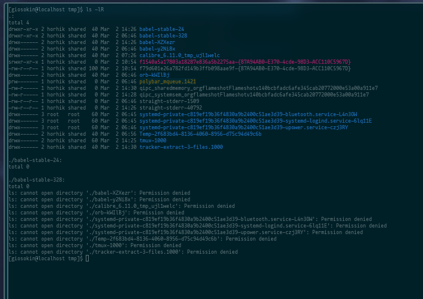{#fig:4 width=70%}


## ls 

просмотрим `/var/spool`

## ls


введем ls и просомтрим файлы в домашней директории. 
Просмотрим разрешения с помощью ls -l

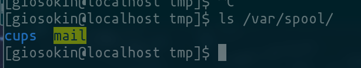{#fig:5 width=70%}

## ls 

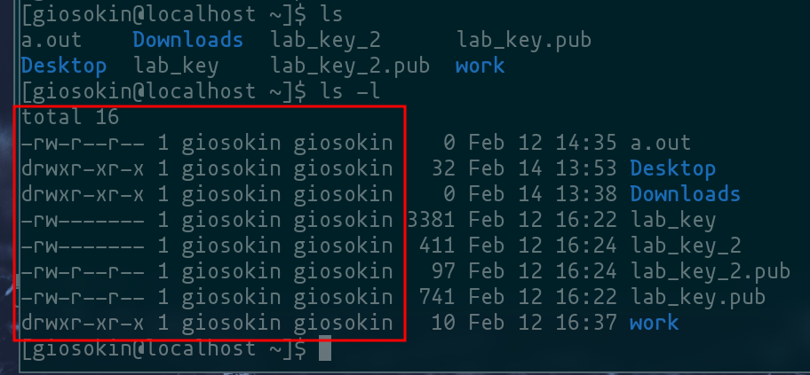{#fig:6 width=70%}

# Работа с mkdir

## mkdir
- создадим директорию `newdir`
- создадим в ней  поддиректорию `morefun` 
- создадим три папки
- просмотрим все с помощью ls и 

## mkdir 

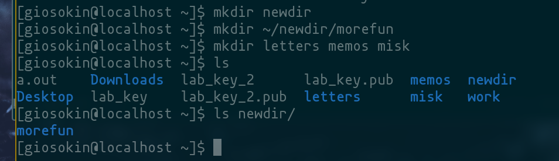{#fig:7 width=70%}

## rm -r

удалим созданные три папки

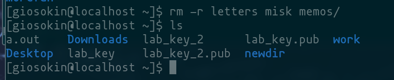{#fig:8 width=70%}

## rm 

попытаемся удалить newdir с помощью rm 

потом с помощью rm -r, т.к. у нас не получилось

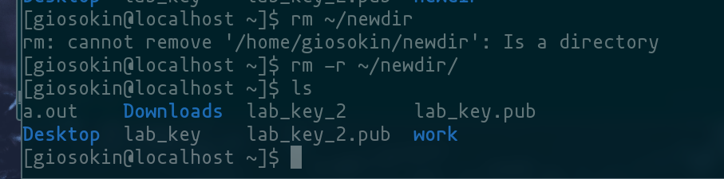{#fig:9 width=70%}

# Работа с man

## man

откроем мануал по `ls`

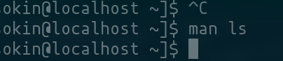{#fig:10 width=70%}

## man ls -R

откроем мануал man и найдем опцию про рекурсивному просмотру 

{#fig:11 width=70%}

## man ls -lt

найдем опцию `-lt` которая сортирует по времени

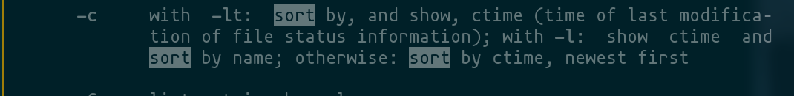{#fig:12 width=70%}

## man cd

откроем мануал `cd`

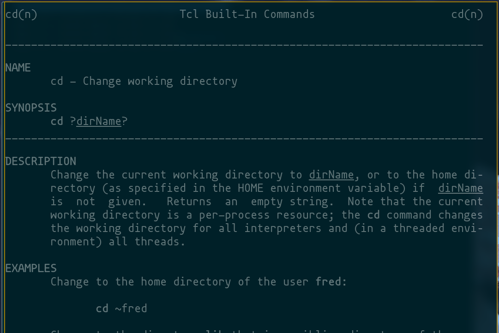{#fig:13 width=70%}

## man pwd

просмотрим man `pwd`

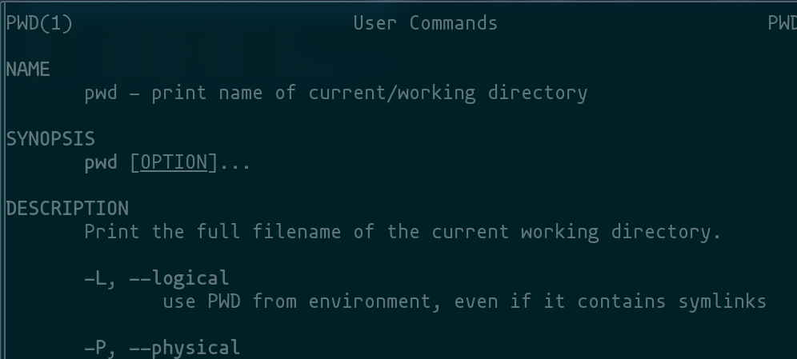{#fig:14 width=70%}


# history

## просмотрим history

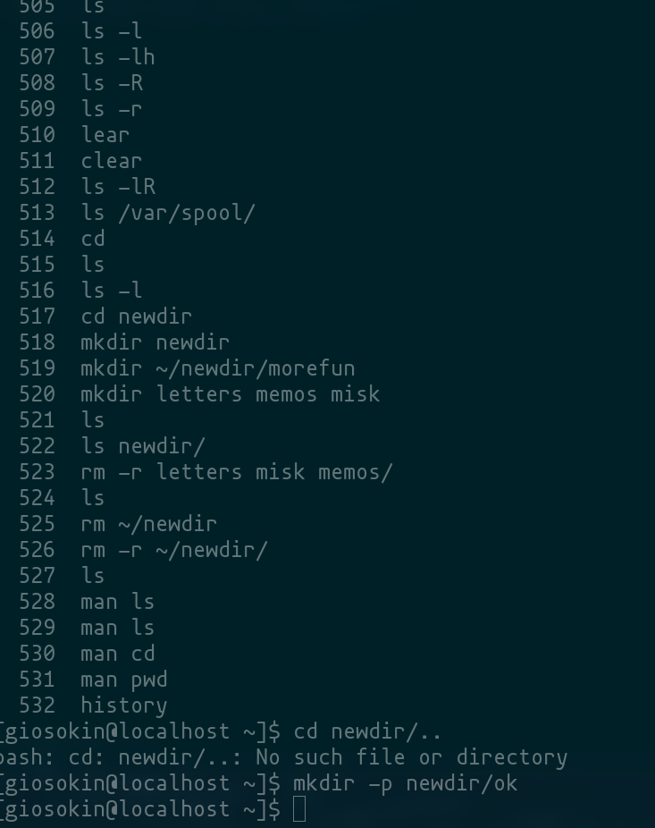{#fig:15 width=70%}

# Ответы на контрольные вопросы

## 1.

Что такое командная строка?

интерфейс для взаимодействия пользователя с операционной системой

## 2.

При помощи какой команды можно определить абсолютный путь текущего каталога? Приведите пример.

pwd


## 3.

При помощи какой команды и каких опций можно определить только тип файлов и их имена в текущем каталоге? Приведите примеры.

ls

## 4.
Каким образом отобразить информацию о скрытых файлах? Приведите примеры.

ls -a

## 5.

При помощи каких команд можно удалить файл и каталог? Можно ли это сделать одной и той же командой? Приведите примеры.

rm -r

## 6.

Каким образом можно вывести информацию о последних выполненных пользовате- лем командах? работы?

history

## 7.

Как воспользоваться историей команд для их модифицированного выполнения? При- ведите примеры.

нажать tab

## 8.

Приведите примеры запуска нескольких команд в одной строке.

```
firefox &; telegram-dekstop
```

## 9.

Дайте определение и приведите примера символов экранирования.

```
\n
echo "meow\n"
```

## 10.

Охарактеризуйте вывод информации на экран после выполнения команды ls с опцией -l.

вывод подробной информации, включая права пользователей размер файла и авторство и число ссылок

## 11.

Что такое относительный путь к файлу? Приведите примеры использования относительного и абсолютного пути при выполнении какой-либо команды.

```
cd /home/username
cd ~
cd ../username
```


## 12.

Как получить информацию об интересующей вас команде?

`man <command>`
  
## 13. 

Какая клавиша или комбинация клавиш служит для автоматического дополнения вводимых команд?

tab


# Выводы

  * Мы НИЧЕМУ НЕ НАУЧИЛИСЬ ВСЕ ТЛЕН приобрели практические навыки взаимодействия пользователя с системой посредством коммандной строки

