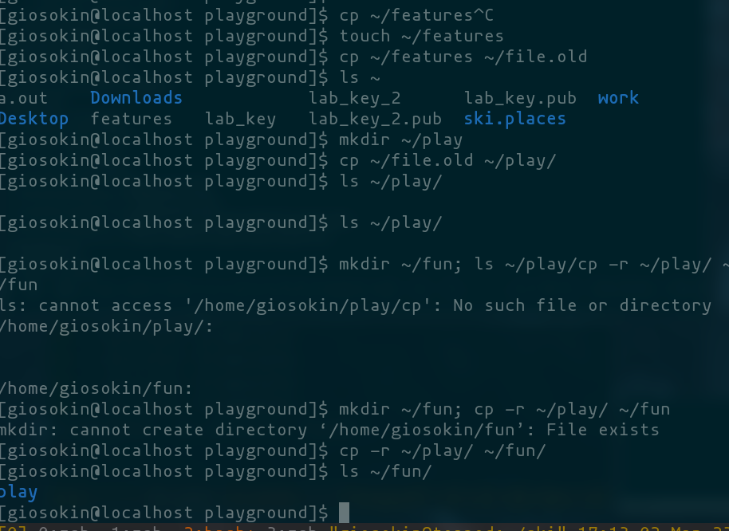

---
## Front matter
title: "Лабораторная работа 5"
subtitle: "Анализ файловой системы Linux"
author: "Осокин Георгий Ивановчи НММбд-02-22"

## Generic otions
lang: ru-RU
toc-title: "Содержание"

## Bibliography
bibliography: bib/cite.bib
csl: pandoc/csl/gost-r-7-0-5-2008-numeric.csl

## Pdf output format
toc: true # Table of contents
toc-depth: 2
lof: true # List of figures
lot: true # List of tables
fontsize: 12pt
linestretch: 1.5
papersize: a4
documentclass: scrreprt
## I18n polyglossia
polyglossia-lang:
  name: russian
  options:
	- spelling=modern
	- babelshorthands=true
polyglossia-otherlangs:
  name: english
## I18n babel
babel-lang: russian
babel-otherlangs: english
## Fonts
mainfont: PT Serif
romanfont: PT Serif
sansfont: PT Sans
monofont: PT Mono
mainfontoptions: Ligatures=TeX
romanfontoptions: Ligatures=TeX
sansfontoptions: Ligatures=TeX,Scale=MatchLowercase
monofontoptions: Scale=MatchLowercase,Scale=0.9
## Biblatex
biblatex: true
biblio-style: "gost-numeric"
biblatexoptions:
  - parentracker=true
  - backend=biber
  - hyperref=auto
  - language=auto
  - autolang=other*
  - citestyle=gost-numeric
## Pandoc-crossref LaTeX customization
figureTitle: "Рис."
tableTitle: "Таблица"
listingTitle: "Листинг"
lofTitle: "Список иллюстраций"
lotTitle: "Список таблиц"
lolTitle: "Листинги"
## Misc options
indent: true
header-includes:
  - \usepackage{indentfirst}
  - \usepackage{float} # keep figures where there are in the text
  - \floatplacement{figure}{H} # keep figures where there are in the text
---

# Введение

## Цель работы

Ознакомление с файловой системой Linux, её структурой, именами и содержанием
каталогов. Приобретение практических навыков по применению команд для работы
с файлами и каталогами, по управлению процессами (и работами), по проверке исполь-
зования диска и обслуживанию файловой системы.

# Выполнение лабораторной работы

## Выполнение примеров из теоритической части

Скопируем файл abc1 в `april` и `may`

{#fig:1 width=70%}

## Пример 2

скопируем `папку` monthly в `april`

{#fig:2 width=70%}

##  Пример 3

скопируем  `monthly/may` в файл с именем `june`

{#fig:3 width=70%}

## Пример 4 mkdir

-  Скопируем каталог monthly в каталог monthly.00

{#fig:4 width=70%}

## Пример 5 mkdir 

- скопируем monthly.00 в /tmp
- просмотрим с помощью ls

{#fig:5 width=70%}

## Пример 6 cp


Нужно переименовать файл с именем "april" на "july" в текущем каталоге. Для этого нужно выполнить следующие команды:

{#fig:6 width=70%}

## Пример 7 mv

Переместим may в monthly.00

{#fig:7 width=70%}

## Пример 8 touch 

Создадим файл may и дадим ему права на исполнение

{#fig:8 width=70%}

##  Пример 9 chmod

Заберем у пользователя права на исполнение

{#fig:9 width=70%}

## Пример 2.1

2.1. Копируем файл /usr/include/sys/io.h в домашний каталог и называем его equipment. Если файла io.h нет, то используем любой другой файл в каталоге /usr/include/sys/ вместо него.

{#fig:11 width=70%}


## 2.2. Создаем в домашнем каталоге директорию ~/ski.plases.

{#fig:12 width=70%}

## 2.3. Перемещаем файл equipment в каталог ~/ski.plases.

{#fig:13 width=70%}

## 2.4. Переименовываем файл 

~/ski.plases/equipment в ~/ski.plases/equiplist.

{#fig:14 width=70%}

## 2.5. Создаем в домашнем каталоге 

файл abc1 и копируем его в каталог ~/ski.plases, называем его equiplist2.

{#fig:15 width=70%}

## 2.6. Создаем каталог с именем equipment в каталоге ~/ski.plases.

 Перемещаем файлы ~/ski.plases/equiplist и equiplist2 в каталог ~/ski.plases/equipment.

{#fig:16 width=70%}


## 2.8. Создаем и перемещаем каталог ~/newdir в каталог ~/ski.plases 

{#fig:17 width=70%}

# Работа с разрешениями 


## Определим разрешения трех файлов

- australia 744
- play 711
- my_os 544
- features 644

{#fig:17 width=70%}

# Упражнения с выводом комманд

## Просмотр содержимого файла /etc/password

Для просмотра содержимого файла /etc/password, выполним следующую команду:
```
cat /etc/passwd
```
Данная команда выведет содержимое файла /etc/password в терминал.

{#fig:18 width=70%}

## Копирование файла ~/feathers в файл ~/file.old

Для копирования файла ~/feathers в файл ~/file.old, выполним следующую команду:

``` bash 

cp ~/feathers ~/file.old
```

Данная команда скопирует файл ~/feathers в файл ~/file.old.

{#fig:19 width=70%}

## Перемещение файла ~/file.old в каталог ~/play

Для перемещения файла ~/file.old в каталог ~/play, выполним следующую команду:

``` bash 

mv ~/file.old ~/play/
```

Данная команда переместит файл ~/file.old в каталог ~/play.

{#fig:20 width=70%}

## Копирование каталога ~/play в каталог ~/fun

Для копирования каталога ~/play в каталог ~/fun, выполним следующую команду:

``` bash

cp -r ~/play ~/fun
```

Данная команда скопирует каталог ~/play в каталог ~/fun.

{#fig:21 width=70%}

## Перемещение каталога ~/fun в каталог ~/play и назовите его games

Для перемещения каталога ~/fun в каталог ~/play и назовите его games, выполним следующую команду:

```bash

mv ~/fun ~/play/games
```

Данная команда переместит каталог ~/fun в каталог ~/play и переименует его в games.

{#fig:22 width=70%}

## Лишение владельца файла ~/feathers прав на чтение
Для лишения владельца файла ~/feathers прав на чтение, выполним следующую команду:

``` bash 

chmod u-r ~/feathers
```

Данная команда лишит владельца файла ~/feathers прав на чтение.

{#fig:23 width=70%}

## Попытка просмотра файла ~/feathers командой cat
Если мы попытаемся просмотреть файл ~/feathers командой cat, то увидим сообщение об ошибке "Permission denied", так как у нас нет прав на чтение данного файла.

## ПРочтем мануалы man

Прочтем мануалы по mount, fsck, mkfs, kill

- mount для подключения дисков
- fsck для восстановления файловой системы
- mkfs для создания файловой системы
- kill для отправки сигнала на процесс

{#fig:24 width=70%}

# Ответы на контрольные вопросы

## Вопрос 1

1. Дайте характеристику каждой файловой системе, существующей на жёстком диске
компьютера, на котором вы выполняли лабораторную работу.

	На жестком диске компьютера, на котором я выполняла лабораторную работу, были установлены следующие файловые системы: ext4, swap и vfat. ext4 - это распространенная файловая система для Linux, vfat - файловая система для устройств с файловыми системами FAT32 и FAT16, 

## Вопрос 2

2. Приведите общую структуру файловой системы и дайте характеристику каждой директории первого уровня этой структуры.

	Общая структура файловой системы Linux: корневой каталог (/), каталоги исполняемых файлов (/bin), конфигурационные файлы (/etc), домашние каталоги пользователей (/home), временные файлы (/tmp), системные файлы (/sys) и устройства (/dev).

## Вопрос 3

3. Какая операция должна быть выполнена, чтобы содержимое некоторой файловой системы было доступно операционной системе?

	Необходимо произвести монтирование файловой системы.

## Вопрос 4

4. Назовите основные причины нарушения целостности файловой системы. Как устранить повреждения файловой системы?

	Основные причины нарушения целостности файловой системы: сбои в питании, неправильное завершение работы, ошибки в работе программного обеспечения. Повреждения файловой системы могут быть устранены с помощью специализированных инструментов, таких как fsck.

## Вопрос 5

5. Как создаётся файловая система?

	Файловая система создается с помощью утилиты mkfs, которая форматирует блочное устройство, подготавливая его для использования.

## Вопрос 6

6. Дайте характеристику командам для просмотра текстовых файлов.

	Основные команды для просмотра текстовых файлов: cat (вывод содержимого файла в терминал), less (постраничный просмотр содержимого файла), head (вывод первых строк файла), tail (вывод последних строк файла).

## Вопрос 7

7. Приведите основные возможности команды cp в Linux
   
   Основные возможности команды cp в Linux: копирование файлов и директорий, рекурсивное копирование содержимого директории, переименование файлов и директорий, установка разрешений на файлы и директории при копировании.

# Выводы

##  Заключение

Мы ознакомились с файловой системыой LInux и ее структурой, именами и содержание м каталогов. ПРиобрели практические навыки по приемению комманд для работы с файлам и каталогами, по управлению просцессами, попроверке использования диска и обслуживанию файловой системы
