---
## Front matter
lang: ru-RU
title: Лабораторная 6
subtitle: Поиск файлов. Перенаправление ввода-вывода. Просмотр запущенных процессов
author:
  - Осокин Г.И НММБД0222
institute:
  - Российский университет дружбы народов, Москва, Россия
  - Российский Областной УльтраФизический Университет, города Иванов, Нарьян-марская Область
date: 03 марта 2523

## i18n babel
babel-lang: russian
babel-otherlangs: english

## Formatting pdf
toc: false
toc-title: Содержание
slide_level: 2
aspectratio: 169
section-titles: true
theme: metropolis
header-includes:
 - \metroset{progressbar=frametitle,sectionpage=progressbar,numbering=fraction}
 - '\makeatletter'
 - '\beamer@ignorenonframefalse'
 - '\makeatother'
---

# Информация

## Докладчик

:::::::::::::: {.columns align=center}
::: {.column width="70%"}

  * Осокин Георгий Ивановчи
  * Студент НММбд-02-22
  * Российский университет дружбы народов
  * [1132226517@pfur.ru](1132226517@pfur.ru)

:::

::::::::::::::

# Введение

## Цель работы

Ознакомление с инструментами поиска файлов и фильтрации текстовых данных.
Приобретение практических навыков: по управлению процессами (и заданиями), по проверке использования диска и обслуживанию файловых систем.

# Выполнение лабораторной работы

## Осуществим вход 

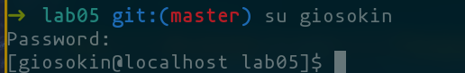{#fig:001 width=70%}

## Впишем файлы в file.txt

Запишем названия файлов из /etc, потом из ~

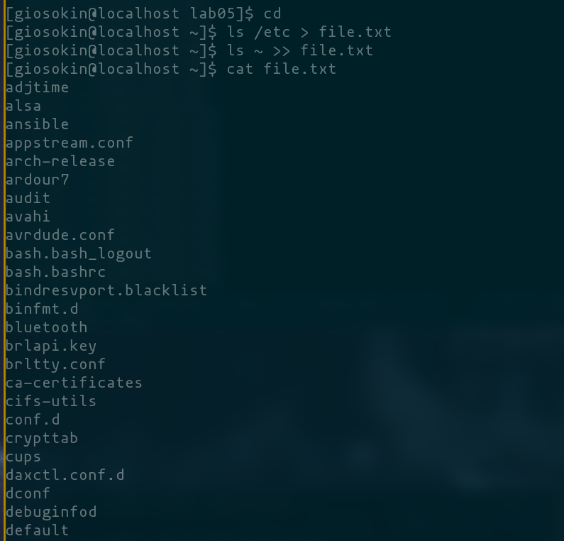{#fig:2 width=70%}

## Вывдем имена всех файлов с раширением .conf
После выведем их в новый текстовый файл.

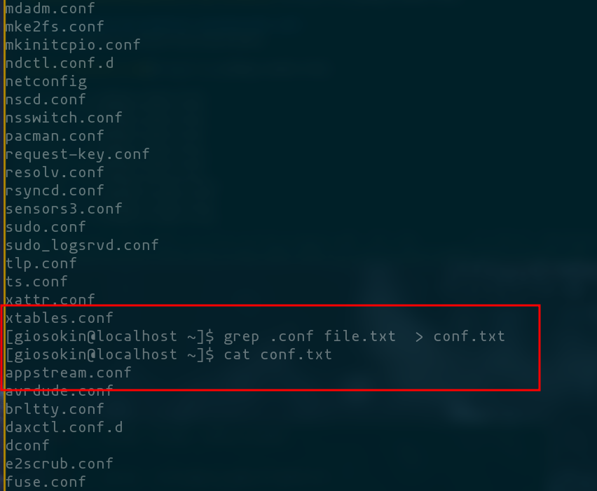{#fig:3 width=70%}

## Определим, каке файлы начинаются с `c`

Выведем с помощью комманд `ls c*` и `file -n c*` и `ls | grep c*`

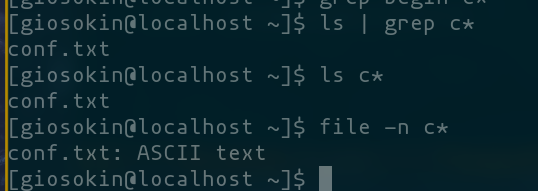{#fig:4 width=70%}

## Выведем имена файлов из каталога /etc

Выведем те, что начинаются на h, воспользовавшись коммандой find

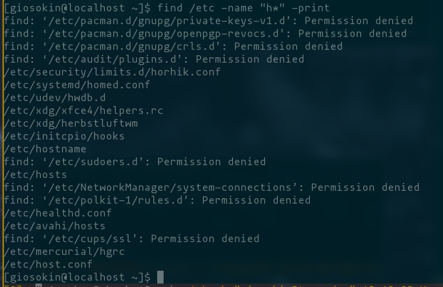{#fig:5 width=70%}

## Запустим фоновый просцц

Запустим процесс, который будет записывать в файл ~/logfile файлы, имена которых начинаются с log.

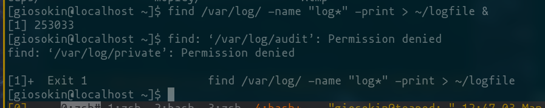{#fig:6 width=70%}

## Удалим ~/logfile

Удалим коммандой rm 

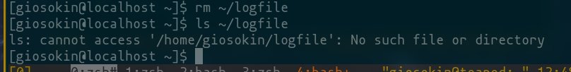{#fig:7 width=70%}

## Запустим geidt в фоновом режиме

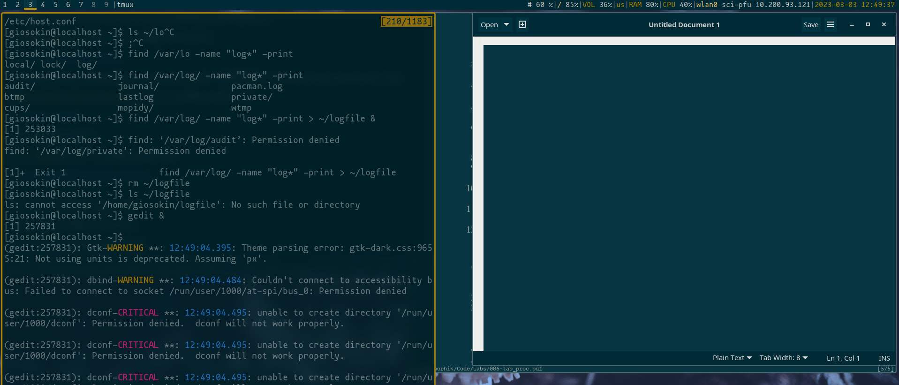{#fig:8 width=70%}

## Определим Id процесса

Воспользуемя  ТРУБАМИ, коммандами grep и sed
Напишем регулярное выражение, что бы вывести только id.

также можно просто воспользоваться коммандой `pid gedit`

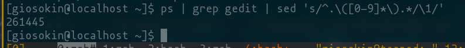{#fig:9 width=70%}

## УБЬЕМ gedit

коммандой `kill $(pidof)

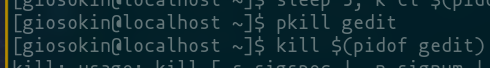{#fig:10 width=70%}

## df и du

Выведем информацию о размерах смонтированных разделов и о размерах файлов домашней директории с помощью df и du

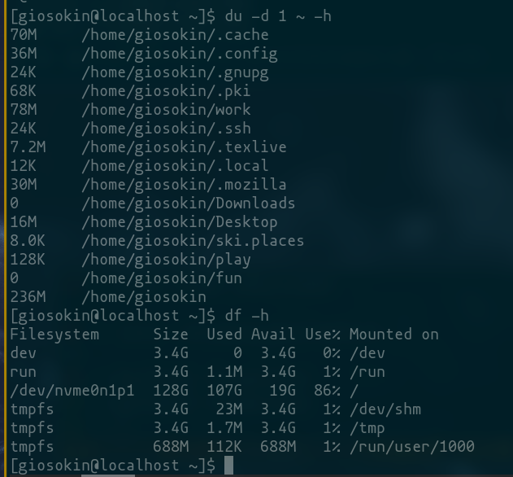{#fig:11 width=70%}

## Выведем все директории домашнего каталога

Исполним комманду ` find ~ -mindepth 1 -maxdepth 1   -type d`


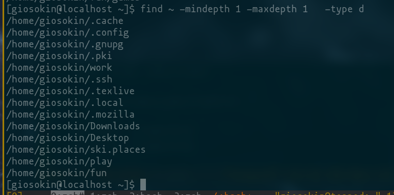{#fig:12 width=70%}

# Ответы на контрольне вопросы

## Какие потоки ввода вывода вы знаете?

stdin, stdou, sderr

## Объясните разницу между операцией > и >>.

`>` перезаписывает файл
`>>`  добавляет в конец файла  

## Что такое конвейер?

КОНВЕЕР ЭТО ТРУБА. Pipe по английски. Позволяет перенаправлять вывод одной комманды, вдругую. 

## Что такое процесс? Чем это понятие отличается от программы?

Процесс, это когда что-то происходит. ЭТО РАЗВИТИЕ, ДЕЙСТИВЕ. ЭВОЛЮЦИЯ. ну или просто программа, каждая програма является процессом. 

В Linux процесс - это экземпляр программы, которая запущена в операционной системе. Каждый процесс имеет свой уникальный идентификатор (PID) и хранит информацию о своем состоянии, включая текущее местоположение в коде, данные, регистры и т.д.

Понятие процесса отличается от понятия программы тем, что программа представляет собой набор инструкций и данных, записанных на диске, тогда как процесс - это активное выполнение программы в оперативной памяти. То есть, процесс может существовать только во время выполнения программы, в то время как программа может быть сохранена на диске в виде исполняемого файла, ожидая запуска.

## Что такое PID и GID?
PID (Process ID) - это уникальный идентификатор процесса в операционной системе. Каждый процесс в операционной системе Linux имеет свой уникальный идентификатор PID, который используется для управления и отслеживания процессов в системе. PID может быть использован, например, для прерывания, приостановки или завершения процесса.

GID (Group ID) - это идентификатор группы пользователей в Linux. Каждый пользователь в Linux может принадлежать одной или нескольким группам пользователей, каждая из которых имеет свой уникальный идентификатор GID. Идентификатор группы используется для управления правами доступа к файлам и другим ресурсам в системе, которые могут быть разрешены или запрещены для конкретных групп пользователей.

## Что такое задачи и какая команда позволяет ими управлять?

ЗАДАЧИ ЭТО ПРОЦЕССЫ

## Найдите информацию об утилитах top и htop. Каковы их функции?

htop это расширенная версия top. Она позволяте просматривать запущенные процессы

## Назовите и дайте характеристику команде поиска файлов. Приведите примеры использования этой комманды 

    Команда поиска файлов в Linux называется find. Эта команда используется для поиска файлов в указанном каталоге или подкаталогах по определенным критериям, таким как имя файла, тип файла, дата изменения и т. д.

Например, чтобы найти все файлы с расширением .txt в текущем каталоге и его подкаталогах, можно использовать следующую команду:

```
find . -name "*.txt" -type f
```
## Можно ли по контексту (содержанию) найти файл? Если да, то как?

можно найти файл по его контексту или содержанию. Для этого можно использовать команду grep, которая ищет указанный текст в указанных файлах или потоках данных.

Например, чтобы найти все строки с текстом "hello world" в файле example.txt, можно использовать следующую команду:

```
grep "hello world" example.txt
```

## Как определить объем свободной памяти на жёстком диске?

c помощью df

## Как определить объем вашего домашнего каталога?

с помощью du

```bash
du -h ~
```

12. Как удалить зависший процесс

```
kill -KILL <pid>
```

# Заключение

## Выводы

Мы ознакомились с инструментами поиска файлов и фильтрации текстовых данных.
Приобрили практических навыков: по управлению процессами (и заданиями), по проверке использования диска и обслуживанию файловых систем.
