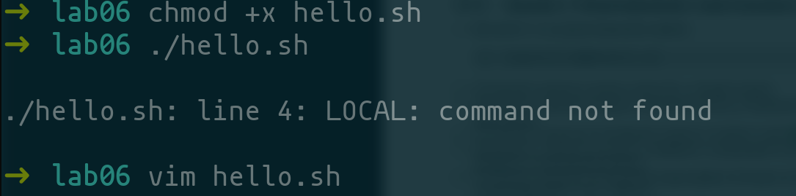
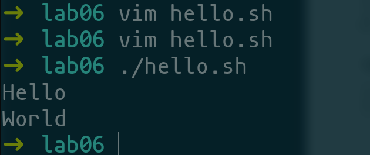

---
## Front matter
lang: ru-RU
title: Лабораторная работа 8
subtitle: Тоталитарная  деградация Пользователей Midnight Commander
author:
  - Осокин Георгий
institute:
  - Российский университет дружбы народов, Москва, Россия
  - Антисемитская Школа Трупов имени Селина 1938
date: 35 ноября 1918

## i18n babel
babel-lang: russian
babel-otherlangs: english

## Formatting pdf
toc: false
toc-title: Содержание
slide_level: 2
aspectratio: 169
section-titles: true
theme: metropolis
header-includes:
 - \metroset{progressbar=frametitle,sectionpage=progressbar,numbering=fraction}
 - '\makeatletter'
 - '\beamer@ignorenonframefalse'
 - '\makeatother'
---

# Информация

## Докладчик

:::::::::::::: {.columns align=center}
::: {.column width="70%"}

  * Осокин Георгий Ивановчи
  * Студент НММбд-02-22
  * Российский университет дружбы народов
  * [1132226517@pfur.ru](1132226517@pfur.ru)

:::

::::::::::::::

# Вступление

## Цель работы

Изучить вим. ВЫЙТИ ИЗ ВИМА. ЗАКРЫТЬ ОКНО НЕ ВЫХОДИ ОСТАНЬСЯ В ПОМЕЩЕНИИ ЗАКРОЙ ОКНО НЕ ДЕЛАЙ ШАГ

# Выполнение лабораторной работы

## Создадим папку

{#fig:001 width=70%}

## Введем текст в VIM 

{#fig:002 width=70%}

## Попытаемся исполнить файл

МЫ СОВЕРШИЛИ ОШИБКУ

{#fig:003 width=70%}

## Исправим файл

{#fig:004 width=70%}

## ВЫЙДЕМ ИЗ АДА 

{#fig:005 width=70%}

## Исполним

Все работает

{#fig:006 width=70%}

# Заключение

## Выводы

МЫ ЗАЙКИ МЫ ВЫШЛИ ИЗ ВИМА
