---
## Front matter
lang: ru-RU
title: Лабораторная Работа 9
subtitle: ПРИСВЕТЕЙШИЙ EMACS
author:
  - ОСОКИН Г.И
institute:
  - Российский университет дружбы народов, Москва, Россия
  - Тайный Клуб ФАНАТОВ ИВАНА МУЛИНА
date: ЗА ГОД ДО ЛАТЕКСНОЙ РЕВОЛЮЦИИ

## i18n babel
babel-lang: russian
babel-otherlangs: english

## Formatting pdf
toc: false
toc-title: Содержание
slide_level: 2
aspectratio: 169
section-titles: true
theme: metropolis
header-includes:
 - \metroset{progressbar=frametitle,sectionpage=progressbar,numbering=fraction}
 - '\makeatletter'
 - '\beamer@ignorenonframefalse'
 - '\makeatother'
---

# Информация

## Докладчик

:::::::::::::: {.columns align=center}
::: {.column width="70%"}

  * Осокин Георгий Ивановчи
  * Студент НММбд-02-22
  * Российский университет дружбы народов
  * [1132226517@pfur.ru](1132226517@pfur.ru)

:::

::::::::::::::

# Вступление

## Цель работы

ПОКАЗАТЬ ЧТО EMACS ПРЕКРАСЕН, ЧТО ЭТОТ КУСОК СОФТА СТАРШЕ 40 ЛЕТ ДОСТОИН СТАТЬ НЕ ПРОСТО ВАШИМ ТЕКСТОВЫМ РЕДАКТОРОМ, А ОПЕРАЦИОННОЙ СИСТЕМОЙ. ПРОДАТЬ НАБЛЮДАЮЕМУ ПРЕЗЕНТАЦИЮ БЕСПЛАТНЫЙ СОФТ ЗА ДУШУ ЕГО РОДСТВЕННИКОВ И ПОДНЯТЬ СЕБЕ САМООЦЕНКУ

# Выполнение лабораторной работы

## ВСТАВИМ текст

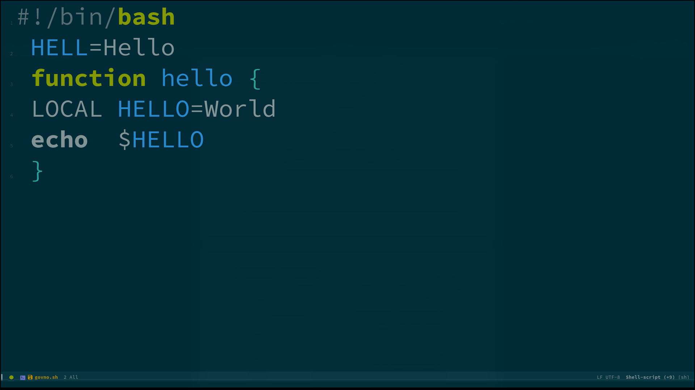{#fig:001 width=70%}

## ИСПРАВИМ ТЕКСТ

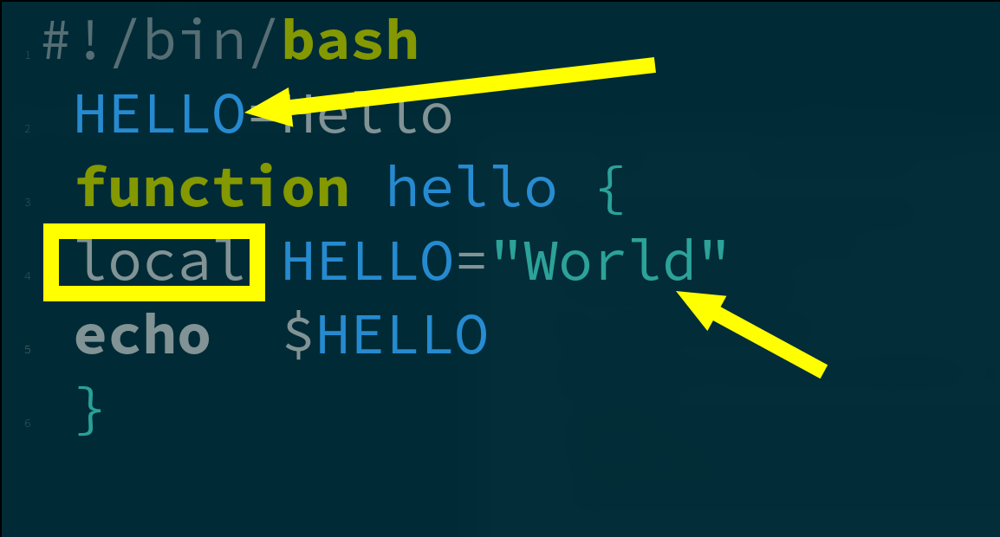{#fig:002 width=70%}

## СОЗДАДИМ ОКНО С ТЕРМИНАЛОМ

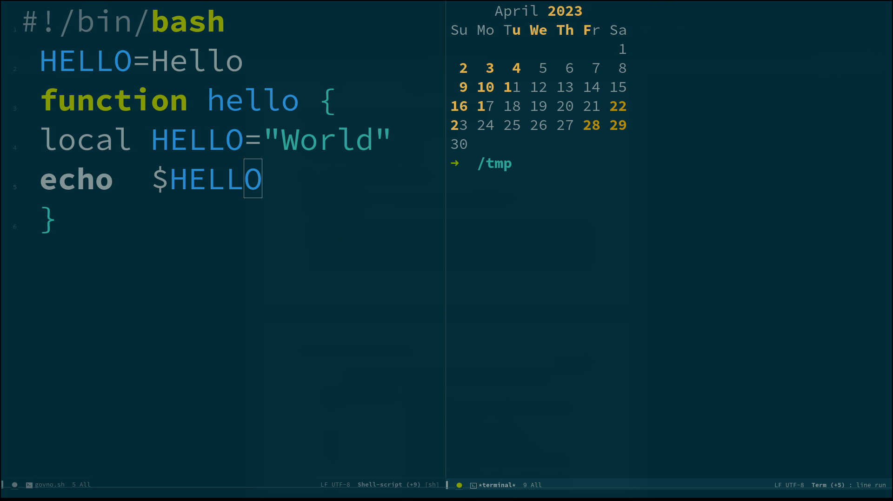{#fig:003 width=70%}

## ЗАПУСТИМ СКРИПТ

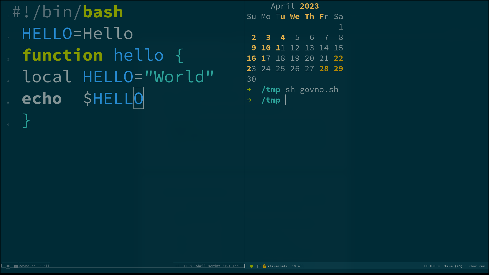{#fig:004 width=70%}

## ИСПРАВИМ ФАЙЛ И ЗАПУСТИМ ЗАНОВО

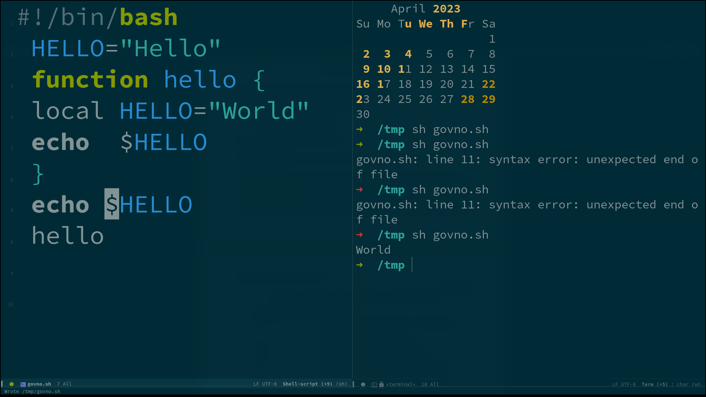{#fig:005 width=70%}

## ПРИВЕТ НЕПТУН

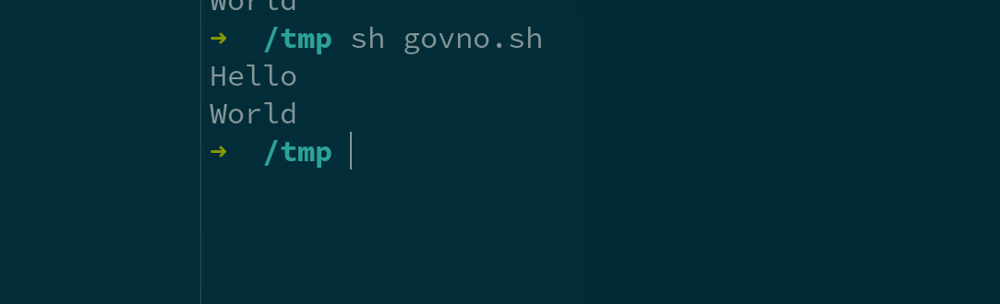{#fig:006 width=70%}

## ЗАКРОЕМ ОКНО

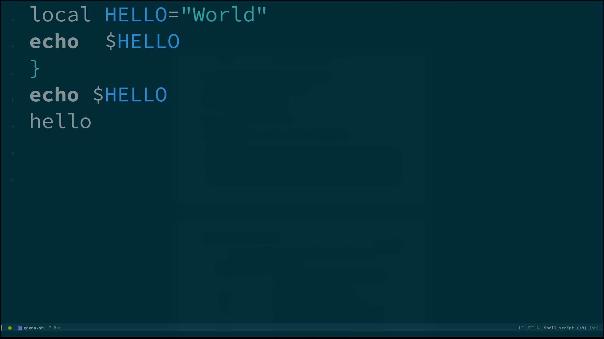{#fig:007 width=70%}

## ВОСПОЛЬЗУЕМСЯ ПОИСКОМ

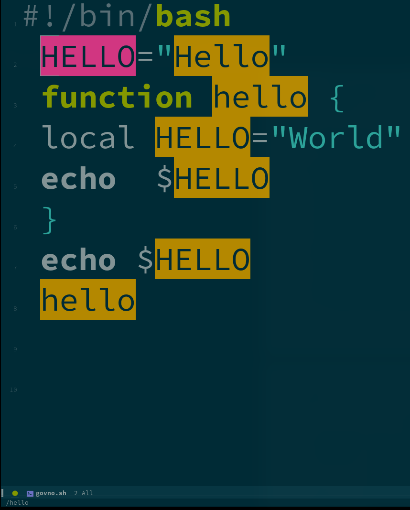{#fig:008 width=70%}

## ПРОСОТРИМ ОТКРЫТЕ БУФЕРА

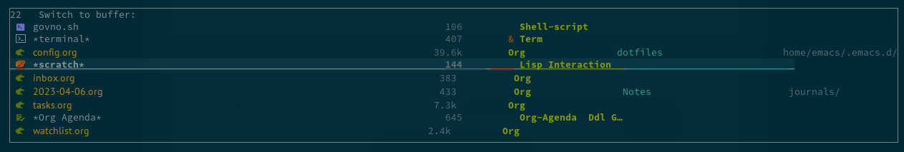{#fig:009 width=70%}

## СОЗДАДИМ ТУЕВУ ХУЧУ ОКОН

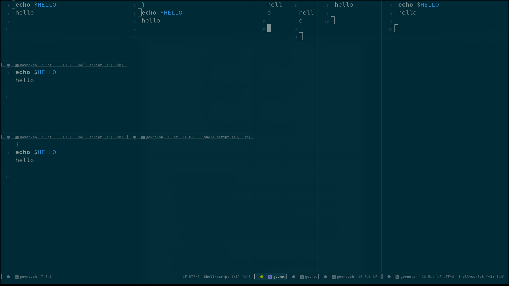{#fig:010 width=70%}

## ЗАКРОЕМ НЕСКОЛЬКО ОКОН

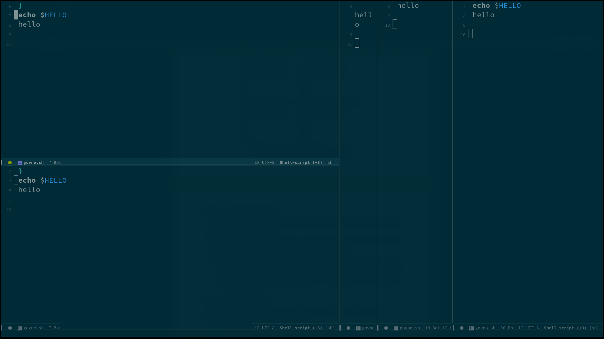{#fig:011 width=70%}

# Заключение

## Выводы

Emacs is THE BEST.  Лично я ничему не научился, я и так поклоняюсь Ридчарду Столлману уже 3 года.
