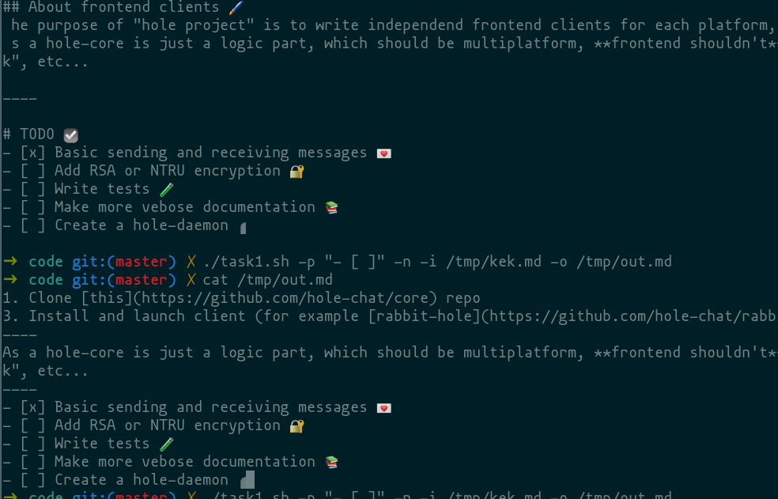
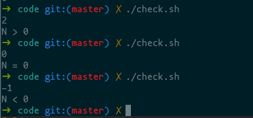
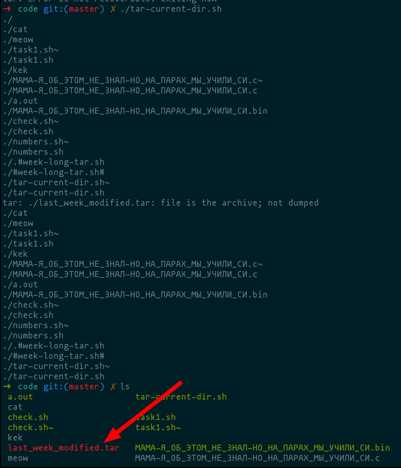

---
## Front matter
title: "Лабораторная 11"
subtitle: "Программирование в программном процессоре ОС UNIX"
author: "Осокин Георгий Иванович"

## Generic otions
lang: ru-RU
toc-title: "Содержание"

## Bibliography
bibliography: bib/cite.bib
csl: pandoc/csl/gost-r-7-0-5-2008-numeric.csl

## Pdf output format
toc: true # Table of contents
toc-depth: 2
lof: true # List of figures
lot: true # List of tables
fontsize: 12pt
linestretch: 1.5
papersize: a4
documentclass: scrreprt
## I18n polyglossia
polyglossia-lang:
  name: russian
  options:
	- spelling=modern
	- babelshorthands=true
polyglossia-otherlangs:
  name: english
## I18n babel
babel-lang: russian
babel-otherlangs: english
## Fonts
mainfont: PT Serif
romanfont: PT Serif
sansfont: PT Sans
monofont: PT Mono
mainfontoptions: Ligatures=TeX
romanfontoptions: Ligatures=TeX
sansfontoptions: Ligatures=TeX,Scale=MatchLowercase
monofontoptions: Scale=MatchLowercase,Scale=0.9
## Biblatex
biblatex: true
biblio-style: "gost-numeric"
biblatexoptions:
  - parentracker=true
  - backend=biber
  - hyperref=auto
  - language=auto
  - autolang=other*
  - citestyle=gost-numeric
## Pandoc-crossref LaTeX customization
figureTitle: "Рис."
tableTitle: "Таблица"
listingTitle: "Листинг"
lofTitle: "Список иллюстраций"
lotTitle: "Список таблиц"
lolTitle: "Листинги"
## Misc options
indent: true
header-includes:
  - \usepackage{indentfirst}
  - \usepackage{float} # keep figures where there are in the text
  - \floatplacement{figure}{H} # keep figures where there are in the text
---

# НАЧАЛО 🩸

## Цель работы

Изучить основы программирования в оболочке OC UNIX. Научиться писать более сложные коммандные файлы.

# Выполнение работы

## Прорграмма с getops

{#fig:001 width=70%}

Код: 

```bash
#!/bin/bash

file=''
filecontent=''
case_sensetive=0
line_numbers=0
template='O'

get-template () {
    template=$1
}

get-input () {
   file=$1
}

put-input () {
    nums=$([ "$line_numbers" = "1" ] &&  echo   "-n")
    lines=$([ "$case_sensetive" = "0" ] && echo  "-i" )
    echo - $nums $lines
    grep  $template $file $nums $lines > $1
}

helpme () {
    echo  "-p to specify the template"
    echo  "-C case sensivity ( 0 or 1 )"
    echo  "-n show line numbers"
    echo  "-p template string"
    echo  "-i input file"
    echo  "-o output file"
}

while getopts  'p:n:i:o:C:' opt; do
    case $opt in
	p) get-template $OPTARG ;;
	C) case_sensetive=1 ;;
	n) line_numbers=1 ;;
	i) get-input "$OPTARG" ;;
	o) put-input "$OPTARG" ;;
	?) echo "YOU'RE WORNG 🙈"; helpme ; exit 1;
    esac
done
```
## Программа на C определяющая пложительность числа

{#fig:001 width=70%}

Код:

```c
#include <stdio.h>
/*
Написать на языке Си программу, которая вводит число и определяет, является ли оно
больше нуля, меньше нуля или равно нулю. Затем программа завершается с помощью
функции exit(n), передавая информацию в о коде завершения в оболочку. Командный файл должен вызывать эту программу и, проанализировав с помощью команды
$?, выдать сообщение о том, какое число было введено
*/

int main () {
  int num = 0;
  scanf("%d", &num);
  if(num > 0 ) {
    exit(0);
  } else if (num < 0) {
    exit(1);
  } else {
    exit(2);
  }

  return 0;
}

```

`check.sh`

```bash
#!/bin/bash

./МАМА-Я_ОБ_ЭТОМ_НЕ_ЗНАЛ-НО_НА_ПАРАХ_МЫ_УЧИЛИ_СИ.bin

var=$?

case $var in
    0) echo "N > 0";;
    1) echo "N < 0";;
    2) echo "N = 0";;
    ?) echo "IT'S OTHER ERROR!!!!"; exit 1;;
esac

```
## Программа нумерующая файлы

{#fig:001 width=70%}

Код:

```bash
#!/bin/zsh

echo "Bash version ${BASH_VERSION}..."

N=1
file=''


setN () {
    N=$1
}
remove-magic (){
    echo "REMOVING FILES"
    for i in {0..$N..1}; do
	new_file=$(echo $file | sed -e $(echo "s/{N}/"$i"/g"))
	rm $new_file;
    done
}

call-magic (){
    echo "CREATING FILES"
    for i in {0..$N..1}; do
	new_file=$(echo $file | sed -e $(echo "s/{N}/"$i"/g"))
	touch $new_file;
    done
}

helpme () {
    echo "-f using to specify file, -n to set files count. File name should be written with \`{N}\` in the place where you want to set numbers"
}

while getopts  ':n:f:r' opt; do
    case $opt in
	n) setN $OPTARG ;;
	f) file=$OPTARG; call-magic $file ;;
	r) remove-magic;;
	?) echo "YOU'RE WORNG 🙈"; helpme;  exit 1;
    esac
done
```

## Программа сжимающая файлы

{#fig:001 width=70%}

Код:

```bash
#!/bin/bash

tar -cvf last_week_modified.tar -o $(find -mtime -7)

```
# Заключение

## Выводы

МЫ ВЫУЧИЛИ ЯЗЫК С! ПАПА ТОЖЕ МОЖЕТ В СИ, ПАПА МОЖЕТ В СИ! ПОКА ВСЕ ТАК, ВСЕ В ПОРЯДКЕ НА РУСИ!
