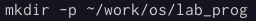
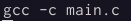
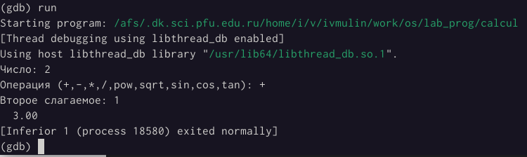

---
## Front matter
lang: ru-RU
title: Лабораторная работа 13
subtitle: Средства, применяемые при разработке программного обеспечения в ОС типа UNIX/Linux
author:
  - Осокин Георгий Иванович
institute:
  - Российский университет дружбы народов
date: 3 dia de la nevera 2021 со дня прихода ИХ

## i18n babel
babel-lang: russian
babel-otherlangs: english

## Formatting pdf
toc: false
toc-title: Содержание
slide_level: 2
aspectratio: 169
section-titles: true
theme: metropolis
header-includes:
 - \metroset{progressbar=frametitle,sectionpage=progressbar,numbering=fraction}
 - '\makeatletter'
 - '\beamer@ignorenonframefalse'
 - '\makeatother'
---

# Информация

## Докладчик

:::::::::::::: {.columns align=center}
::: {.column width="70%"}

  * Осокин Георгий Иванович
  * Математический институт им. Никольского
  * <https://github.com/horhik>

:::
::::::::::::::

# Вводная часть

## Актуальность

- Умение программировать в ОС Unix бывает полезным навыком при работе с компьютером.

# Ход работы

## Цель работы
Цель работы — приобрести простейшие навыки разработки, анализа, тестирования и отладки приложений в ОС типа UNIX/Linux на примере создания на языке программирования С калькулятора с простейшими функциями.

# Выполнение лабораторной работы

## Написание программ

Создали директорию `~/work/os/lab_prog`:



Написали программу `main.c`:

``` C
#include <stdio.h>
#include "calculate.h"

int main (void)
{
    float Numeral;
    char Operation[4];
    float Result;
    printf("Число: ");
    scanf("%f",&Numeral);
    printf("Операция (+,-,*,/,pow,sqrt,sin,cos,tan): ");
    scanf("%s",Operation);
    Result = Calculate(Numeral, Operation);
    printf("%6.2f\n",Result);
    return 0;
}
```


Написали программу `calculate.h`:

``` C
#ifndef CALCULATE_H_
#define CALCULATE_H_

float Calculate(float Numeral, char Operation[4]);

#endif /*CALCULATE_H_*/
```


Написали программу `calculate.c`:

``` C
#include <stdio.h>
#include <math.h>
#include <string.h>
#include "calculate.h"

float Calculate(float Numeral, char Operation[4])
{
	float SecondNumeral;
	if(strncmp(Operation, "+", 1) == 0)
	{
		printf("Второе слагаемое: ");
		scanf("%f",&SecondNumeral);
		return(Numeral + SecondNumeral);
	}
	else if(strncmp(Operation, "-", 1) == 0)
	{
		printf("Вычитаемое: ");
		scanf("%f",&SecondNumeral);
		return(Numeral - SecondNumeral);
	}
	else if(strncmp(Operation, "*", 1) == 0)
	{
		printf("Множитель: ");
		scanf("%f",&SecondNumeral);
		return(Numeral * SecondNumeral);
	}
	else if(strncmp(Operation, "/", 1) == 0)
	{
		printf("Делитель: ");
		scanf("%f",&SecondNumeral);
		if(SecondNumeral == 0)
		{
			printf("Ошибка: деление на ноль! ");
			return(HUGE_VAL);
		}
		else
		return(Numeral / SecondNumeral);
	}
	else if(strncmp(Operation, "pow", 3) == 0)
	{
		printf("Степень: ");
		scanf("%f",&SecondNumeral);
		return(pow(Numeral, SecondNumeral));
	}
	else if(strncmp(Operation, "sqrt", 4) == 0)
		return sqrt(Numeral);
	else if(strncmp(Operation, "sin", 3) == 0)
		return(sin(Numeral));
	else if(strncmp(Operation, "cos", 3) == 0)
		return(cos(Numeral));
	else if(strncmp(Operation, "tan", 3) == 0)
		return(tan(Numeral));
	else
	{
		printf("Неправильно введено действие ");
		return(HUGE_VAL);
	}
}
```


Скомпилировали программы при помощи команд

``` bash
gcc -c calculate.c
gcc -c main.c
gcc calculate.o main.o -o calcul -lm
```



Для автоматизации сборки написали `Makefile`:

``` Makefile
CC = gcc
CFLAGS =
LIBS = -lm

calcul: calculate.o main.o
	gcc calculate.o main.o -o calcul $(LIBS)

calculate.o: calculate.c calculate.h
	gcc -c calculate.c $(CFLAGS)

main.o: main.c calculate.h
	gcc -c main.c $(CFLAGS)

clean:

	-rm calcul *.o *~
```


## Отладка программы

Прежде чем начать отладку, запустили `Makefile`:


Запустили отладчик gdb и провели отладку кода:



При помощи команды `splint` проанализировали код программ `calculate.c` и `main.c`:


## Ответы на контрольные вопросы

1. Как получить информацию о возможностях программ gcc, make, gdb и др.?

_Ответ_: при помощи программы `man`.

2. Назовите и дайте краткую характеристику основным этапам разработки приложений в UNIX.

_Ответ_:
	1. Выбор названия
	2. Выбор языка программирования
	3. Попытка выполнить работу всю зараз
	4. Отрицание
	5. Гнев
	6. Торг
	7. Депрессия
	8. Принятие

3. Что такое суффикс в контексте языка программирования? Приведите примеры использования.

_Ответ_: финальная часть названия программы, обычно отделяемая точкой.

4. Каково основное назначение компилятора языка С в UNIX?

_Ответ_: компилятор языка C в UNIX в основном компилирует программы языка C в UNIX, написанные на языке C в UNIX.

5. Для чего предназначена утилита make?

_Ответ_: для того чтобы `делать`.

6. Приведите пример структуры Makefile. Дайте характеристику основным элементам этого файла.

_Ответ_: всё выполнил, как и просили.

7. Назовите основное свойство, присущее всем программам отладки. Что необходимо сделать, чтобы его можно было использовать?

_Ответ_: свойство - анализ кода; для анализа необходимо скомпилировать программу.

8. Назовите и дайте основную характеристику основным командам отладчика gdb.

_Ответ_: см. ответ к вопросу 6.

9. Опишите по шагам схему отладки программы, которую вы использовали при выполнении лабораторной работы.

_Ответ_:
	1. Вначале я запустил `gdb`
	2. Затем я его закрыл

10. Прокомментируйте реакцию компилятора на синтаксические ошибки в программе при его первом запуске.

_Ответ_: когда я увидел реакцию компилятора на синтаксические ошибки в программе при его первом запуске,я был возмущён, поражён, обескуражен, ошеломлён, фрустрирован и изумлён. Но использовал совершенно другие выражения.

11. Назовите основные средства, повышающие понимание исходного кода программы.

_Ответ_: здравый смысл и нормальный код.

12. Каковы основные задачи, решаемые программой splint?

_Ответ_: анализ кода.


## Заключение

В ходе выполнения лабораторной работы были изучены простейшие навыки разработки, анализа, тестирования и отладки приложений в ОС типа UNIX/Linux на примере создания на языке программирования С калькулятора с простейшими функциями. Цель работы была достигнута.
