---
## Front matter
lang: ru-RU
title: Первая часть индивидуального проекта
subtitle: РУДН
author:
  - Осокин Георгий иванович
institute:
  - Российский университет дружбы народов, Москва, Россия
date: 22 февраля 2023

## i18n babel
babel-lang: russian
babel-otherlangs: english

## Formatting pdf
toc: false
toc-title: Содержание
slide_level: 2
aspectratio: 169
section-titles: true
theme: metropolis
header-includes:
 - \metroset{progressbar=frametitle,sectionpage=progressbar,numbering=fraction}
 - '\makeatletter'
 - '\beamer@ignorenonframefalse'
 - '\makeatother'
---

# Информация

## Докладчик

:::::::::::::: {.columns align=center}
::: {.column width="70%"}

  * Осокин Георгий Ивановчи
  * Студен группы НММбд-02-22
  * Российский университет дружбы народов
  * [1132226517@pfur.ru](mailto:1132226517@pfur.ru
  * <https://horhik.github.io/ru/>

::: 
:::::::::::::: 

# Вводная часть

## Актуальность

Очень актуально иметь свой собственный сайт в современном мире

# Цель работы

## Цели и задачи

Пройти первый этап создания индивидуального проекта. Задеплоить созданный на hugo сайт, на гитхаб и выложить его в сеть.

# Теоретическое введение

## Введение

Мы будем пользовать утилитой Hugo и шаблоном wowchemy. А также сервисом гихаб, и возможностью для хостинга статических сайтов, которые он нам предоставляет

# Выполнение лабораторной работы

## Установим hugo и go

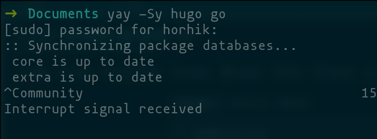{#fig:000 width=70%}

## Создание репозитория из шаблона

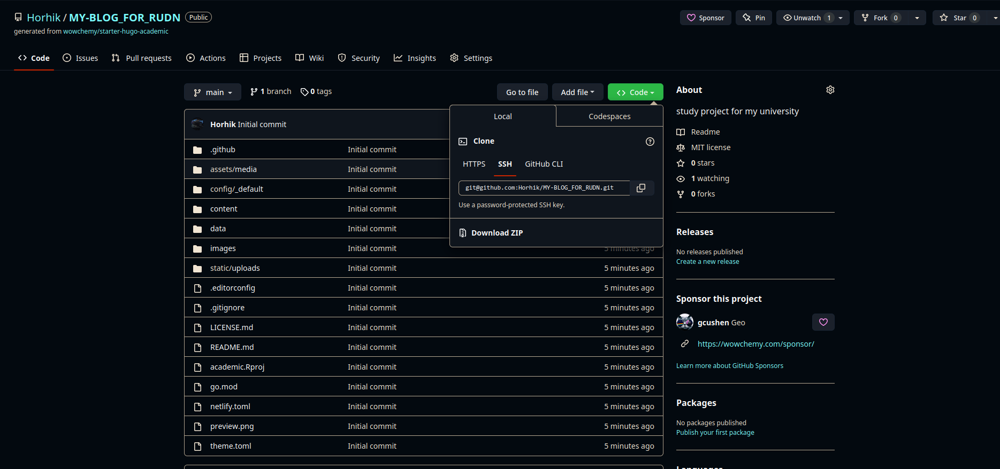{#fig:001 width=70%}

## Запуск hugo 

Коммандой `hugo server` запустить сервер

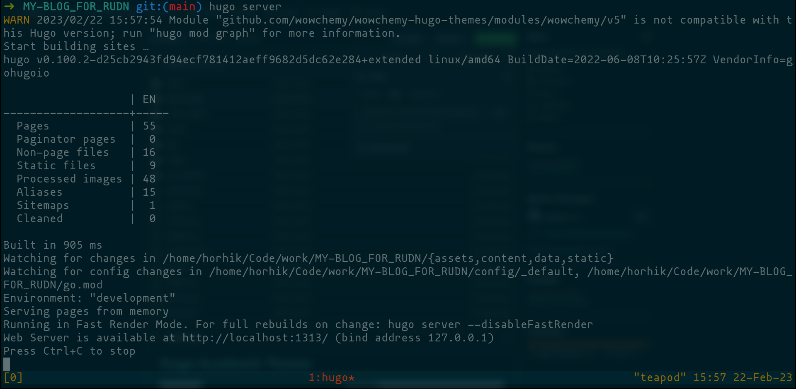{#fig:002 width=70%}

Откроем страницу в браузере

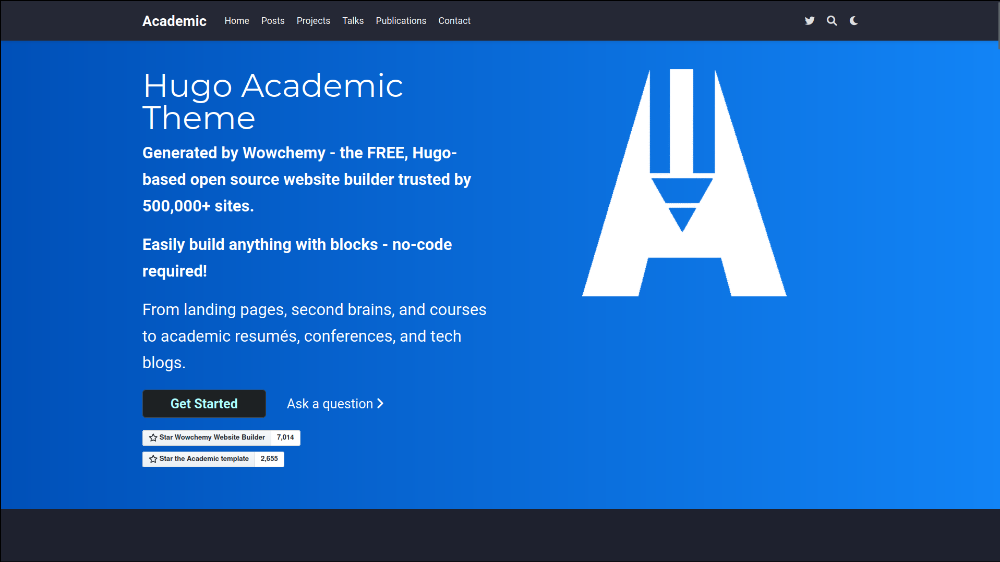{#fig:003 width=70%}

## Удалим демоо часть

В файле `contents/_index.md` удалим первую часть yaml файла

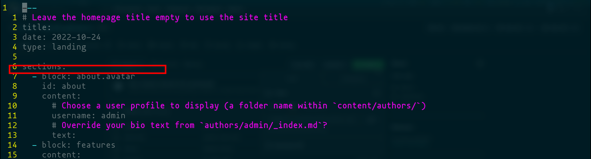{#fig:004 width=70%}

## Отправка на Гитхаб

Выполним git push

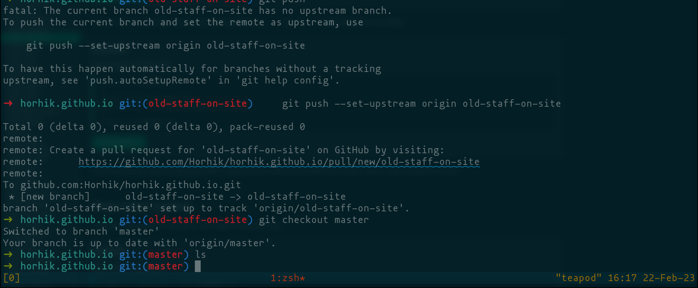{#fig:005 width=70%}

# Создание репозитория для сайта

## Создадим репозиторий `<username>.github.io`

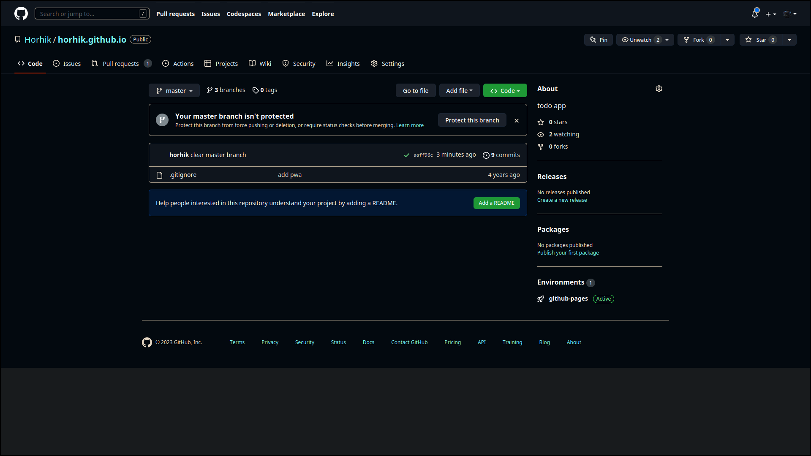{#fig:006 width=70%}
 
## Обновим .gitignore

Перейдем в предыдущий репозиторий и удалим строчку public из gitignore. Отправим изменения на гитхаб

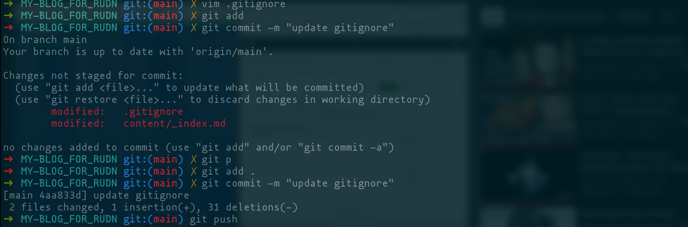{#fig:007 width=70%}

## Добавим submodule

Добавим репозиторий horhik.github.io как submodule в папку public 

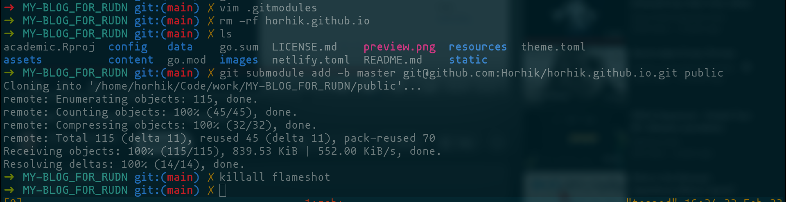{#fig:009 width=70%}

Как видим, папка public заново создалась

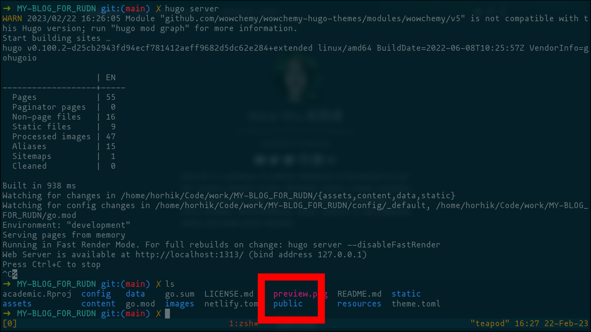{#fig:010 width=70%}

## Сгенерируем содержимое сайта 

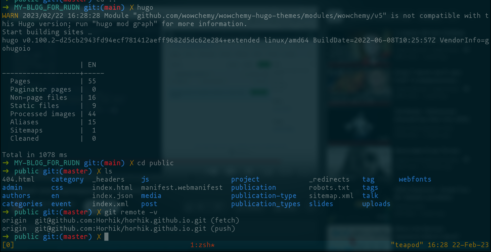{#fig:011 width=70%}

## Отправим изменения в submodule

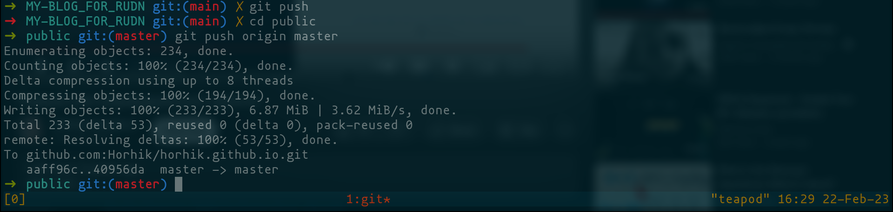{#fig:012 width=70%}

## Просмотр новосозданного сайта

откроем https://horhik.github.io

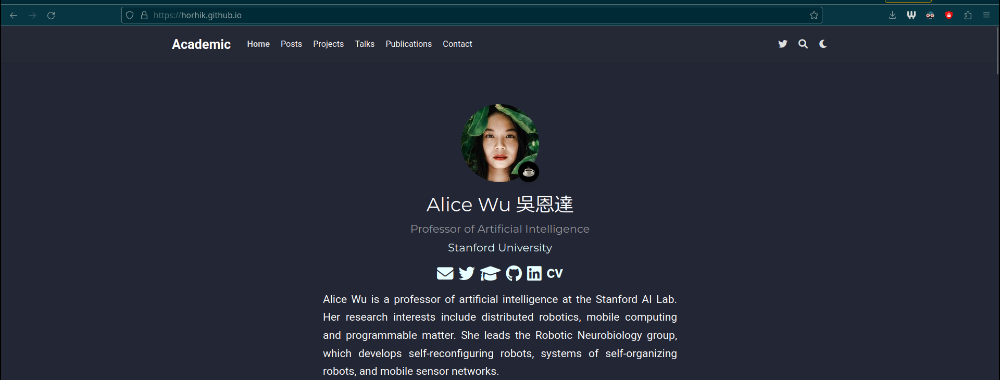{#fig:013 width=70%}

# Заключение

## Вывод

Мы создали сайт на hugo и отправили его на гитхаб

