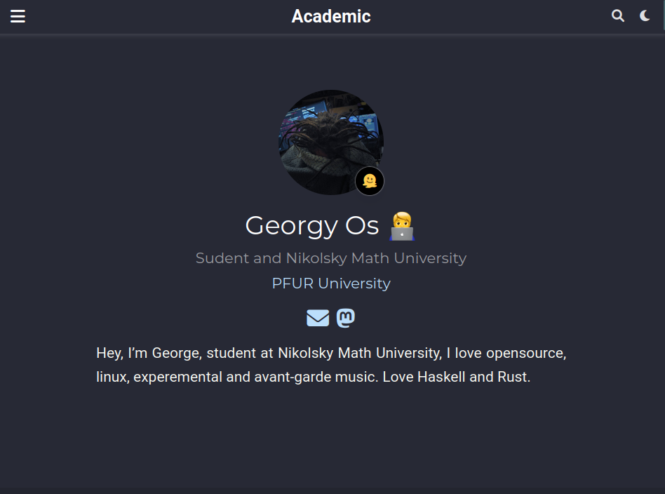
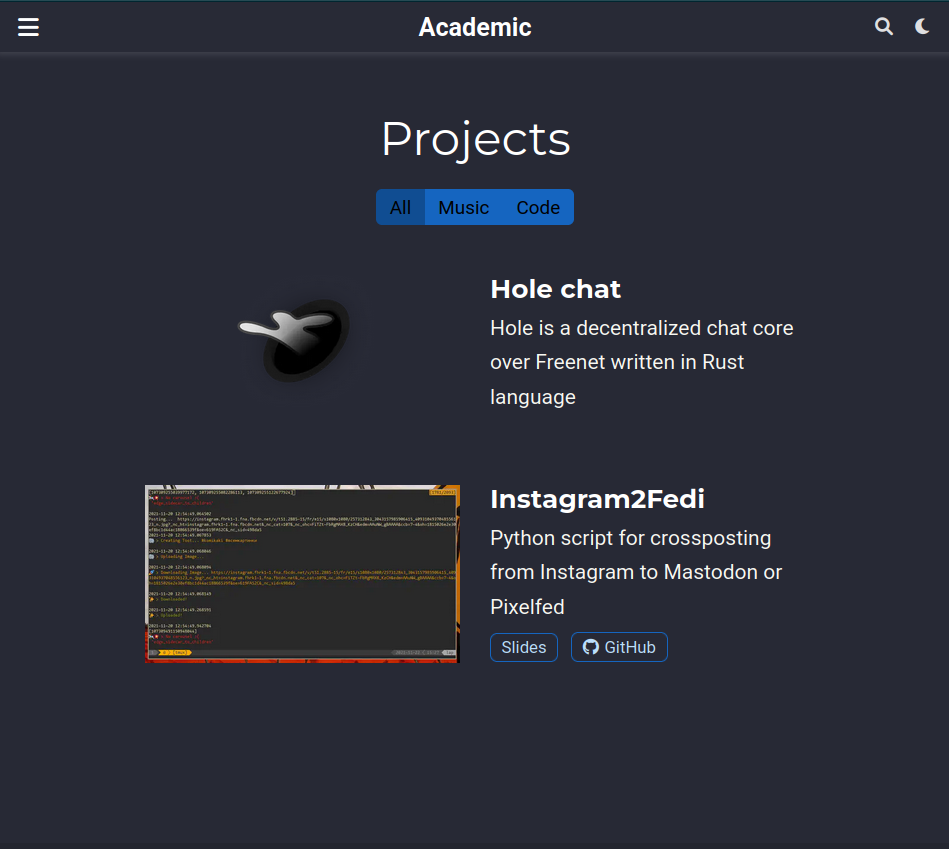
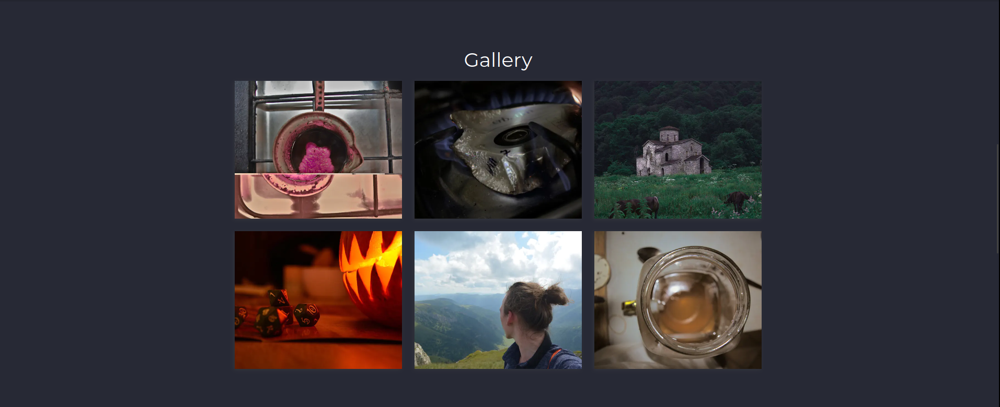
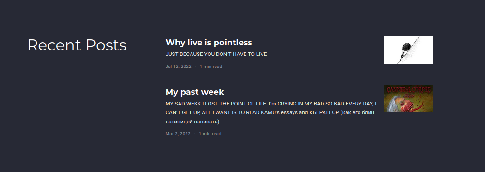

---
## Front matter
lang: ru-RU
title: Выполнение индивидуального проекта
subtitle: СЕРИЯНЫЙ НОМЕР 2
author:
  - ОСКИНГИ
institute:
  - РОЖДЕННЫЙ В ДУБНЕ
date: 01 января 2034523423423472349826359375623854

## i18n babel
babel-lang: russian
babel-otherlangs: english

## Formatting pdf
toc: false
toc-title: Содержание
slide_level: 2
aspectratio: 169
section-titles: true
theme: metropolis
header-includes:
 - \metroset{progressbar=frametitle,sectionpage=progressbar,numbering=fraction}
 - '\makeatletter'
 - '\beamer@ignorenonframefalse'
 - '\makeatother'
---

# Информация

## Докладчик

:::::::::::::: {.columns align=center}
::: {.column width="70%"}

  * Осокин Георгий
  * С детства с рифмой я дружу, нифига я не поэт
  * Российский университет дружбы народов
  * [lazy@zho.pa](mailto:kulyabov-ds@rudn.ru)

:::
::: {.column width="30%"}

#  Вводная инфа

## Цель работы

Выполнить вторую часть индивидуального проекта. Наполнить сайт контентом

# Выполнение лабораторной работы

## Добавим информацию о себе

{#fig:001 width=70%}

## Добавим контакнтую информацию

{#fig:002 width=70%}

## Добавим проекты

{#fig:003 width=70%}

## Добавим фотографии в галерею

{#fig:004 width=70%}

## Добавим публиации

{#fig:005 width=70%}

## Добавим пост про гит

Как мы знаем ГИТ - это Горбуши Икра Тюменская 

{#fig:006 width=70%}

# Выводы

## Выводы

Мы заполнили сайт контентом, выложили несколько постов и добавили информацию о себе
