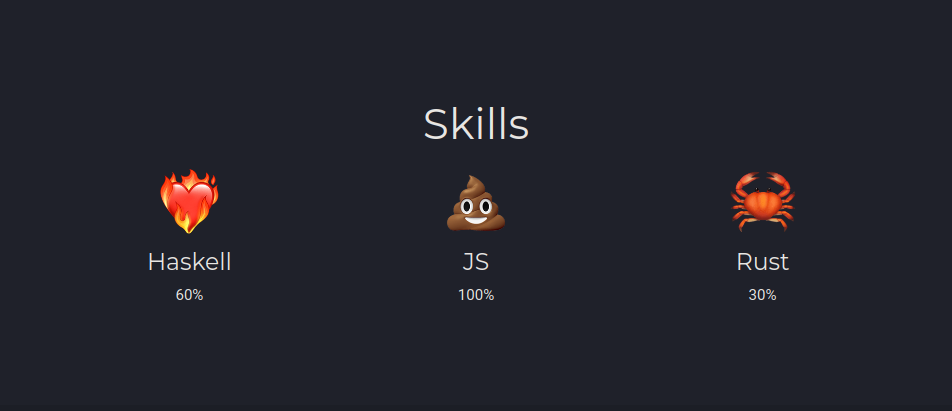
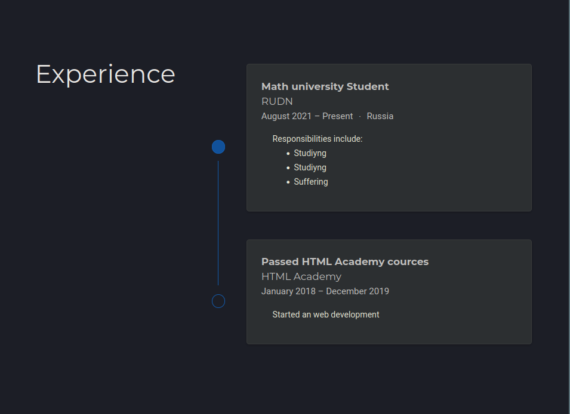
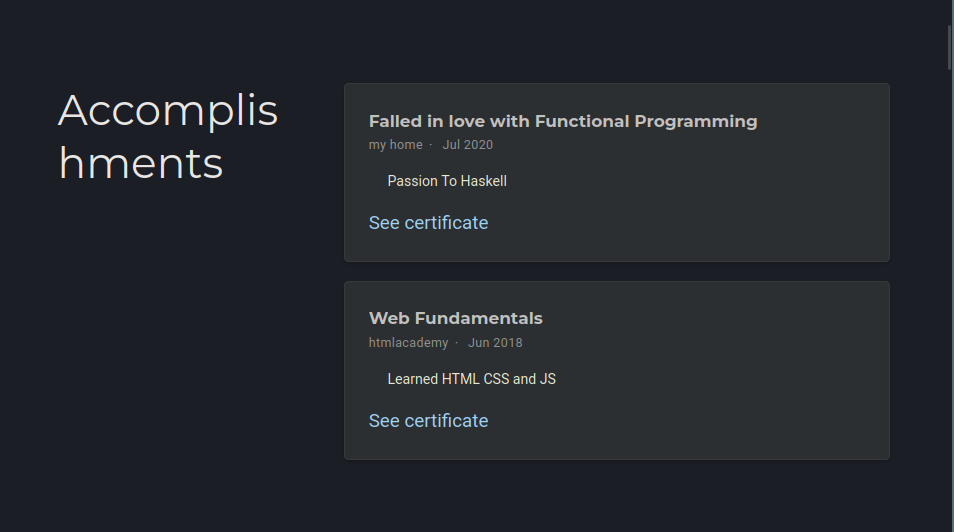
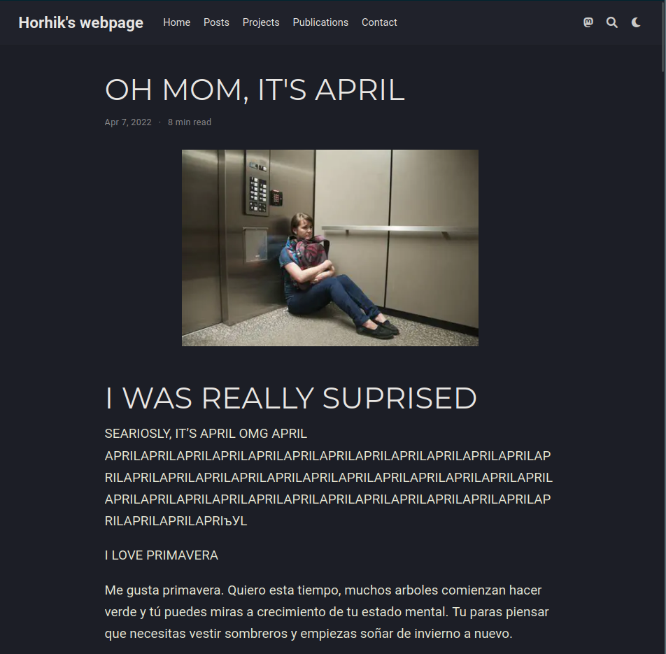
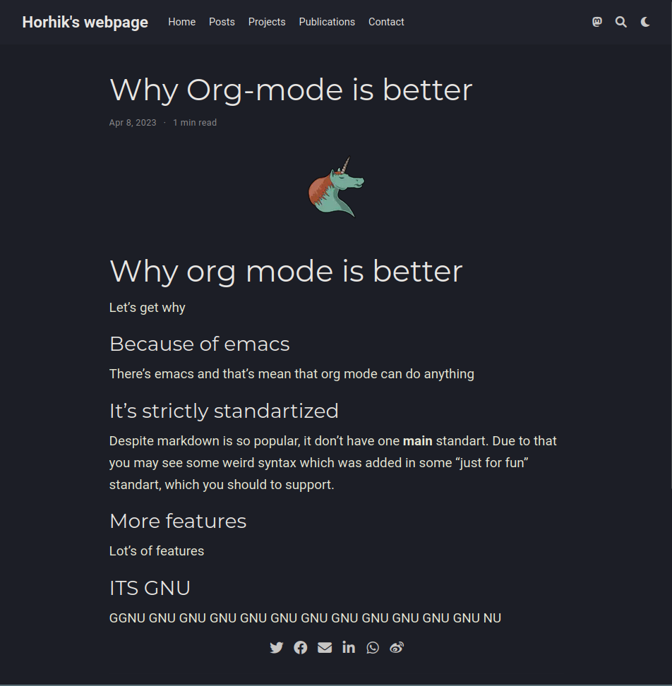

---
## Front matter
lang: ru-RU
title: Добавление достижений на сайт
subtitle: 3 этап реализации проекта
author:
  - Гога
institute:
  - Российский университет дружбы народов, Москва, Россия
  - Заброшенный институт кинк исследований, Дубна, Россия
date: 51 января 304970

## i18n babel
babel-lang: russian
babel-otherlangs: english

## Formatting pdf
toc: false
toc-title: Содержание
slide_level: 2
aspectratio: 169
section-titles: true
theme: metropolis
header-includes:
 - \metroset{progressbar=frametitle,sectionpage=progressbar,numbering=fraction}
 - '\makeatletter'
 - '\beamer@ignorenonframefalse'
 - '\makeatother'
---

# Информация

## Докладчик

:::::::::::::: {.columns align=center}
::: {.column width="70%"}

  * Осокин Георгий
  * Российский университет дружбы народов
  * [lazy@zho.pa](mailto:kulyabov-ds@rudn.ru)

:::
::: {.column width="30%"}

# Цель работы

## Добавить к сайту достижения.

- Список достижений.

	- Добавить информацию о навыках (Skills).
  
    - Добавить информацию об опыте (Experience).
    
	- Добавить информацию о достижениях (Accomplishments).

  - Сделать пост по прошедшей неделе.

  - Добавить пост на тему по выбору:

# Выполнение работы 

## Добавить информацию о навыках (Skills).

{#fig:001 width=70%}
  
## Добавить информацию об опыте (Experience).

{#fig:002 width=70%}
    
## Добавить информацию о достижениях (Accomplishments).

{#fig:003 width=70%}

## Сделать пост по прошедшей неделе.

{#fig:004 width=70%}

## Добавить пост на тему по выбору:

{#fig:005 width=70%}

# Заключение

## Выводы 

Мы добавили информацию о навыках, опыте, достижении и переписали очень душевный рассказ Чарльза Буковски на французском
